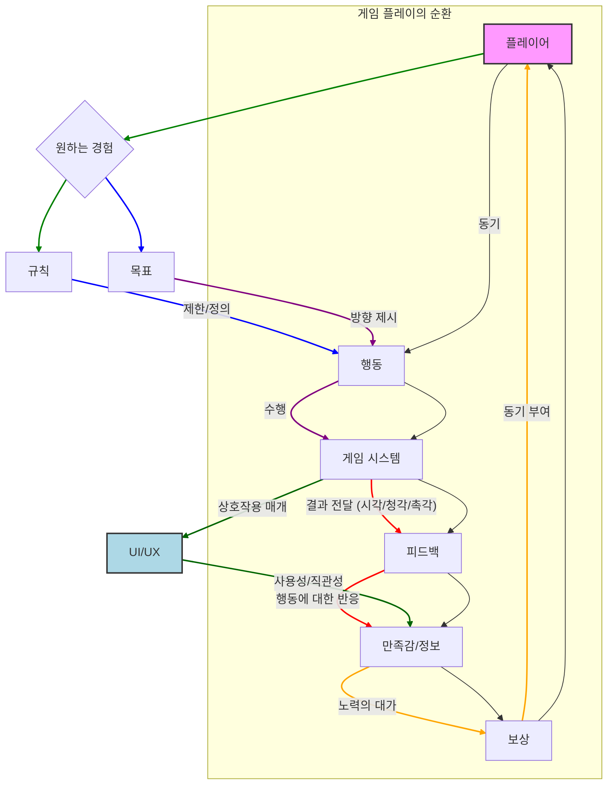
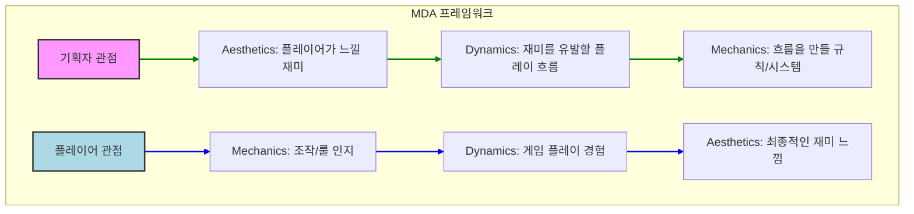
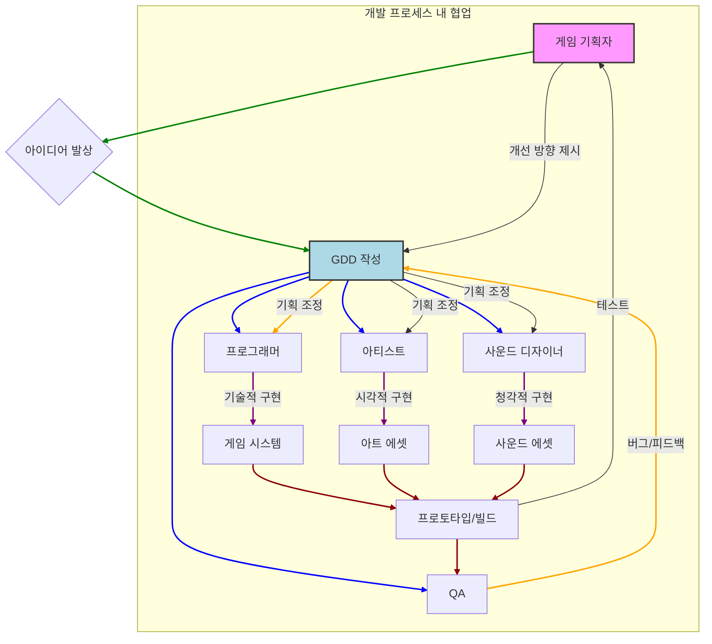

# 게임 기획의 이해와 역할: 게임 개발의 첫 단추

게임 기획은 단순한 아이디어 구상을 넘어, 게임이 어떻게 플레이되고, 어떤 재미를 주며, 궁극적으로 플레이어에게 어떤 경험을 선사할지 설계하는 매우 중요하고 복합적인 작업입니다.
이 모듈은 게임 기획이라는 광활한 세계로 여러분을 초대하여, 게임 기획자의 역할, 게임의 본질적인 요소, 그리고 재미를 만들어내는 방법에 대한 기본적인 이해를 제공합니다.
여러분은 이 학습을 통해 게임을 단순한 유희가 아닌, 치밀하게 설계된 경험 디자인의 결과물로 바라보는 새로운 시각을 갖게 될 것입니다.

게임 산업은 끊임없이 변화하고 발전하며, 이에 따라 게임 기획의 중요성 또한 나날이 커지고 있습니다.
단순히 좋은 아이디어만으로는 성공적인 게임을 만들 수 없습니다.
아이디어를 체계적으로 구체화하고, 개발팀과 효율적으로 소통하며, 시장과 플레이어의 니즈를 정확히 파악하는 능력이 필수적입니다.
이 과정에서 게임 기획자는 게임 개발의 나침반이자 설계자 역할을 수행합니다.

##
💡 학습 목표

이 모듈을 완료하면 여러분은 다음을 수행할 수 있습니다.

*   게임 기획의 정의와 중요성을 설명하고, 게임 개발 프로세스 내에서 기획의 역할을 파악할 수 있습니다.
*   게임 기획자가 갖춰야 할 핵심 역량을 이해하고, 자신의 강점과 보완점을 분석할 수 있습니다.
*   게임을 구성하는 기본적인 요소들(플레이어, 규칙, 목표, 피드백, 보상 등)을 식별하고 그 상호작용을 설명할 수 있습니다.
*   다양한 게임 장르에서 '재미'가 어떻게 구현되는지 이해하고, MDA 프레임워크와 같은 개념을 활용하여 게임의 재미 요소를 분석할 수 있습니다.
*   게임의 핵심 플레이 루프(Core Loop) 개념을 이해하고, 이를 통해 게임 플레이의 본질을 설명할 수 있습니다.
*   효과적인 게임 아이디어 발상 기법과 컨셉 구체화의 초기 단계를 이해하고 적용할 수 있습니다.
*   게임 기획자로서 필요한 윤리적 관점과 지속적인 성장 전략에 대해 인지할 수 있습니다.

---

## 1. 게임 기획, 그 시작과 본질 (⏱


<div class="image-wrapper"><button class="image-regenerate-btn px-3 py-1.5 text-xs text-white font-bold rounded flex items-center gap-1 border border-accent/50 hover:bg-accent transition-colors" onclick="promptRegenerateImage(this, '1. 게임 기획, 그 시작과 본질 (⏱', 'img_1780909901654490')"><i class="ph-bold ph-arrows-clockwise"></i> 다시 찾기</button><div class="image-caption" style="margin-top:8px;text-align:center;font-size:0.85rem;color:#6b7280;font-style:italic;font-weight:500;letter-spacing:-0.01em;line-height:1.4;max-width:100%;">1. 게임 기획, 그 시작과 본질 (⏱</div></div>


️ 60분)

이 섹션에서는 게임 기획이라는 학문과 직업의 정의를 명확히 하고, 왜 게임 개발에 있어서 기획이 필수적인지 그 중요성을 깊이 있게 탐구합니다.
단순히 기술적인 구현을 넘어, 플레이어에게 특별한 경험을 제공하기 위한 기획의 본질을 이해하는 시간입니다.

### 1.1. 게임 기획의 정의와 범위


<div class="image-wrapper"><button class="image-regenerate-btn px-3 py-1.5 text-xs text-white font-bold rounded flex items-center gap-1 border border-accent/50 hover:bg-accent transition-colors" onclick="promptRegenerateImage(this, '1.1. 게임 기획의 정의와 범위', 'img_1780909923952967')"><i class="ph-bold ph-arrows-clockwise"></i> 다시 찾기</button><div class="image-caption" style="margin-top:8px;text-align:center;font-size:0.85rem;color:#6b7280;font-style:italic;font-weight:500;letter-spacing:-0.01em;line-height:1.4;max-width:100%;">1.1. 게임 기획의 정의와 범위</div></div>


게임 기획은 한 마디로 '플레이어가 경험할 게임의 모든 요소를 설계하고 구체화하는 작업'이라고 할 수 있습니다.
이는 단순히 "이런 게임을 만들자!"라는 아이디어 하나로 끝나지 않습니다.
게임의 목표, 규칙, 인터페이스, 스토리, 캐릭터, 시스템, 심지어는 게임 내 경제 시스템까지, 게임을 구성하는 모든 부분에 대한 청사진을 그리는 과정입니다.
기획자는 개발팀의 비전을 설정하고, 이를 현실적인 형태로 변환하여 구체적인 개발 가이드라인을 제시하는 역할을 합니다.

#### Key Concept

*   **게임 기획(Game Design)** 플레이어가 경험할 게임의 모든 요소를 설계하고 구체화하는 과정.
*   **청사진(Blueprint)** 게임 개발의 전체적인 방향과 세부 계획을 담은 문서 또는 구상.
*   **플레이어 경험(Player Experience, PX)** 게임을 플레이하면서 느끼는 총체적인 감정, 생각, 행동.
기획의 핵심 목표.
*   **시스템 설계** 게임 내 규칙, 상호작용, 데이터 흐름 등을 구조화하는 작업.
*   **콘텐츠 설계** 캐릭터, 아이템, 퀘스트, 레벨 등 게임 내 모든 유무형 자산을 기획하는 작업.
*   **사용자 인터페이스(User Interface, UI) 설계** 플레이어가 게임과 상호작용하는 모든 시각적, 기능적 요소를 설계.

#### 구체적 사례

*   **리그 오브 레전드(League of Legends)** 각 챔피언의 스킬, 역할군, 아이템 상호작용, 맵 오브젝트(드래곤, 바론)의 효과 등 모든 것이 치밀하게 기획되어 전략적인 플레이를 유도합니다.
맵의 지형, 정글 몬스터의 배치, 심지어 게임 시간대에 따른 오브젝트 리젠 타이밍까지 모두 기획자의 손을 거쳐 탄생한 결과물입니다.
*   **젤다의 전설: 야생의 숨결(The Legend of Zelda: Breath of the Wild)** 플레이어가 자유롭게 탐험하고 상호작용할 수 있는 오픈월드 환경, 물리 엔진 기반의 퍼즐, 요리 시스템, 날씨 변화 등 모든 요소가 유기적으로 연결되어 플레이어에게 예측 불가능한 경험과 끊임없는 탐험의 동기를 부여하도록 기획되었습니다.

#### 본문 설명

게임 기획은 매우 광범위한 영역을 포괄합니다.
초기 아이디어 단계에서부터 게임의 핵심 컨셉을 정립하고, 이를 바탕으로 구체적인 게임 시스템과 콘텐츠를 설계하며, 플레이어가 게임을 즐기는 동안 어떤 감정을 느끼고 어떤 행동을 할지 예측하고 유도하는 것이 주된 업무입니다.
단순히 "멋있는 캐릭터를 만들자!"라고 말하는 것을 넘어, "이 캐릭터는 어떤 세계관에 속하며, 어떤 스킬을 가지고, 플레이어에게 어떤 재미를 줄 것인가?"와 같은 질문에 대한 답을 찾아가는 과정입니다.

또한, 게임 기획은 지속적인 수정과 개선의 연속입니다.
아무리 완벽해 보이는 초기 기획이라도 개발 과정 중 예상치 못한 문제에 부딪히거나, 시장의 변화에 따라 방향을 수정해야 할 때가 많습니다.
이때 기획자는 유연하게 사고하고, 문제를 해결하며, 더 나은 게임 경험을 위한 최적의 해답을 찾아내야 합니다.
이는 마치 건축가가 건물의 설계도를 그리듯, 게임의 모든 구조와 기능을 미리 구상하고 배치하는 작업과도 같습니다.

궁극적으로 게임 기획의 목표는 '재미있는 게임'을 만드는 것입니다.
여기서 '재미'는 단순한 오락적 즐거움을 넘어, 도전과 성취, 탐험과 발견, 사회적 상호작용 등 플레이어가 게임을 통해 얻을 수 있는 총체적인 긍정적 경험을 의미합니다.
기획자는 이러한 재미를 만들어내기 위해 심리학, 인문학, 사회학 등 다양한 분야의 지식을 활용하며 플레이어의 마음을 읽고 이해하려 노력합니다.

### 1.2. 게임 기획이 필요한 이유: 단순한 재미를 넘어


<div class="image-wrapper"><button class="image-regenerate-btn px-3 py-1.5 text-xs text-white font-bold rounded flex items-center gap-1 border border-accent/50 hover:bg-accent transition-colors" onclick="promptRegenerateImage(this, '1.2. 게임 기획이 필요한 이유: 단순한 재미를 넘어', 'img_1780909948580486')"><i class="ph-bold ph-arrows-clockwise"></i> 다시 찾기</button><div class="image-caption" style="margin-top:8px;text-align:center;font-size:0.85rem;color:#6b7280;font-style:italic;font-weight:500;letter-spacing:-0.01em;line-height:1.4;max-width:100%;">1.2. 게임 기획이 필요한 이유: 단순한 재미를 넘어</div></div>


"그냥 재미있게 만들면 되는 거 아니야?"라고 생각할 수 있지만, '재미'는 주관적이고 추상적인 개념입니다.
이 추상적인 재미를 구체적인 게임 시스템과 콘텐츠로 구현하기 위해서는 체계적인 기획 과정이 필수적입니다.
기획은 단순히 아이디어를 나열하는 것을 넘어, 게임이 가져야 할 핵심 가치를 정립하고, 개발팀 전체가 동일한 목표를 향해 나아가도록 이끄는 역할을 합니다.

#### Key Concept

*   **비전 공유** 개발팀 전체가 게임의 최종 목표와 핵심 가치를 공유하게 하는 과정.
*   **자원 효율성** 체계적인 기획을 통해 개발 시간, 인력, 비용 등의 자원을 효율적으로 배분하고 낭비를 줄이는 것.
*   **문제 예측 및 해결** 개발 전 잠재적 문제를 미리 파악하고, 이에 대한 해결책을 기획 단계에서 모색.
*   **일관된 경험 제공** 게임 전체를 아우르는 일관된 플레이어 경험을 설계하여 혼란을 방지.
*   **시장성 확보** 타겟 플레이어와 시장 트렌드를 분석하여 게임의 성공 가능성을 높이는 전략적 활동.
*   **가치 제안(Value Proposition)** 게임이 플레이어에게 제공하는 고유한 가치나 혜택을 명확히 하는 것.

#### 구체적 사례

*   **사이버펑크 2077(Cyberpunk 2077)** 출시 초기의 수많은 버그와 미완성된 콘텐츠로 인해 비판을 받았습니다.
이는 개발 과정에서 기획과 구현 간의 간극, 혹은 명확한 비전 공유와 품질 관리의 실패가 복합적으로 작용한 결과로 해석됩니다.
명확하고 현실적인 기획의 부재가 얼마나 큰 문제를 야기할 수 있는지 보여주는 사례입니다.
*   **스타크래프트(StarCraft)** 종족 간의 완벽한 밸런스, 직관적인 유닛 조작, 전략적인 깊이 등은 단순한 아이디어를 넘어 오랜 기간의 치밀한 기획과 테스트를 통해 완성되었습니다.
이처럼 게임의 핵심 재미와 깊이를 보장하기 위해서는 체계적인 기획 과정이 필수적입니다.

#### 본문 설명

게임 기획은 '어떤 게임을 만들 것인가?'라는 질문에 대한 답을 찾는 것에서 시작하여, '그 게임을 어떻게 만들어낼 것인가?'에 대한 구체적인 방법을 제시하는 과정입니다.
기획이 없다면 개발팀은 각자의 생각대로 게임을 만들게 되어 프로젝트는 방향성을 잃고 산으로 갈 위험이 큽니다.
이는 마치 설계도 없이 건물을 짓는 것과 같습니다.
아무리 숙련된 기술자들이 모여도, 어떤 형태의 건물을 지을지, 몇 층으로 할지, 어떤 재료를 쓸지 정해지지 않으면 혼란만 가중될 뿐입니다.

또한, 게임 기획은 개발 자원을 효율적으로 사용하기 위해 필수적입니다.
게임 개발은 막대한 시간과 비용, 인력이 투입되는 작업입니다.
명확한 기획은 불필요한 개발을 줄이고, 자원을 필요한 곳에 집중하게 하여 프로젝트의 성공 가능성을 높입니다.
예를 들어, 기획 단계에서 특정 시스템의 구현 난이도와 예상되는 효과를 미리 분석하여, 비효율적인 시스템은 과감히 제외하거나 다른 방식으로 대체할 수 있습니다.

궁극적으로 게임 기획은 플레이어에게 일관되고 만족스러운 경험을 제공하기 위한 약속입니다.
게임의 모든 요소가 유기적으로 연결되어 플레이어가 납득할 만한 세계와 규칙 속에서 의미 있는 활동을 할 수 있도록 설계하는 것이 기획의 최종 목표입니다.
잘 기획된 게임은 플레이어에게 강력한 몰입감을 선사하고, 오랫동안 사랑받는 명작으로 기억될 수 있습니다.

<div class="instructor-callout">
⏰ **예상 소요 시간:** 60분 (강의 40분, 질의응답 및 토론 20분)
💡 **해당 세션에서 수강생이 인지하여야 할 항목**
- 게임 기획의 추상적인 개념을 구체적인 사례와 비유를 통해 이해하는 것.
- 기획이 단순한 아이디어 구상이 아닌, 개발 프로젝트 전체를 아우르는 핵심적인 역할임을 인지하는 것.
- 기획 부재 시 발생할 수 있는 문제점(방향성 상실, 자원 낭비 등)을 명확히 이해하는 것.
💡 **핵심 강조 항목**
- "게임 기획은 게임의 '설계도'이자 '나침반'이다."라는 비유를 통해 중요성을 강조.
- 플레이어 경험(PX)이 게임 기획의 궁극적인 목표임을 지속적으로 언급.
- 게임 기획의 광범위한 영역(시스템, 콘텐츠, UI/UX, 스토리 등)을 설명하여 기획자의 역할을 확장적으로 이해시킨다.
💡 **활용 교보재**
- 게임 기획의 정의 및 범위에 대한 슬라이드 (다양한 게임 장르별 기획 영역 예시 포함)
- 실패한 기획 사례(예: 사이버펑크 2077 초기)와 성공한 기획 사례(예: 스타크래프트, 젤다) 비교 자료
- 게임 개발 초기 단계의 간략한 컨셉 문서 예시 (예: 한 페이지 GDD)
- 질의응답을 위한 판서 또는 디지털 화이트보드
**강의 가이드**
강의 시작 시, "게임 기획"이라는 단어를 들었을 때 수강생들이 가장 먼저 떠올리는 이미지를 질문하고 자유롭게 답변하게 하여 참여를 유도합니다.
그 후, 기획의 정의를 제시하며 단순히 "재미있는 것"을 넘어선 "구체적인 설계"임을 강조합니다.
게임 개발이 하나의 건축물이라면, 기획자는 설계사라는 비유를 사용하여 이해도를 높일 수 있습니다.
사이버펑크 2077의 사례를 통해 기획의 부재나 실패가 프로젝트에 얼마나 치명적인 영향을 미 미칠 수 있는지 현실적인 관점에서 설명합니다.
반대로 잘 기획된 게임의 성공 사례를 들어 기획의 긍정적 효과를 부각합니다.
수강생들이 궁금해할 만한 "아이디어가 있는데 어떻게 시작해야 할까요?"와 같은 질문에 대비하여, 아이디어를 구체화하는 초기 단계의 중요성을 언급하며 다음 섹션으로 자연스럽게 연결합니다.
</div>

---

## 2. 게임 기획자의 역할과 책임 (⏱


<div class="image-wrapper"><button class="image-regenerate-btn px-3 py-1.5 text-xs text-white font-bold rounded flex items-center gap-1 border border-accent/50 hover:bg-accent transition-colors" onclick="promptRegenerateImage(this, '2. 게임 기획자의 역할과 책임 (⏱', 'img_1780909970792634')"><i class="ph-bold ph-arrows-clockwise"></i> 다시 찾기</button><div class="image-caption" style="margin-top:8px;text-align:center;font-size:0.85rem;color:#6b7280;font-style:italic;font-weight:500;letter-spacing:-0.01em;line-height:1.4;max-width:100%;">2. 게임 기획자의 역할과 책임 (⏱</div></div>


️ 60분)

게임 기획자는 게임 개발팀의 핵심적인 포지션으로, 단순한 아이디어 뱅크를 넘어 다양한 역할을 수행합니다.
이 섹션에서는 게임 기획자의 세부적인 역할과 책임, 그리고 성공적인 기획자가 되기 위해 필수적으로 갖춰야 할 역량들에 대해 깊이 있게 다룹니다.

### 2.1. 기획자의 다양한 유형과 포지션


<div class="image-wrapper"><button class="image-regenerate-btn px-3 py-1.5 text-xs text-white font-bold rounded flex items-center gap-1 border border-accent/50 hover:bg-accent transition-colors" onclick="promptRegenerateImage(this, '2.1. 기획자의 다양한 유형과 포지션', 'img_1780909993246369')"><i class="ph-bold ph-arrows-clockwise"></i> 다시 찾기</button><div class="image-caption" style="margin-top:8px;text-align:center;font-size:0.85rem;color:#6b7280;font-style:italic;font-weight:500;letter-spacing:-0.01em;line-height:1.4;max-width:100%;">2.1. 기획자의 다양한 유형과 포지션</div></div>


게임 개발 스튜디오의 규모와 게임의 복잡성에 따라 기획자의 역할은 세분화됩니다.
크게는 시스템 기획, 콘텐츠 기획, 레벨 기획 등으로 나눌 수 있으며, 이 외에도 다양한 전문 분야가 존재합니다.
각 유형의 기획자는 특정 영역에 깊은 전문성을 가지고 게임의 완성도를 높이는 데 기여합니다.

#### Key Concept

*   **시스템 기획자(System Designer)** 게임의 핵심 규칙, 경제 시스템, 전투 시스템 등 근간을 이루는 로직을 설계.
*   **콘텐츠 기획자(Content Designer)** 캐릭터, 아이템, 퀘스트, 스토리, 세계관 등 게임 내 모든 유무형 자산을 생성 및 관리.
*   **레벨 기획자(Level Designer)** 게임 플레이가 이루어지는 공간(맵)의 구조, 오브젝트 배치, 진행 흐름 등을 설계.
*   **UI/UX 기획자(UI/UX Designer)** 사용자 인터페이스(UI)의 레이아웃, 기능, 그리고 플레이어 경험(UX)의 흐름을 최적화.
*   **밸런스 기획자(Balance Designer)** 캐릭터, 스킬, 아이템 등의 능력치 조정을 통해 게임 플레이의 공정성과 재미를 유지.
*   **PM/리드 기획자(Project Manager/Lead Designer)** 전체 기획팀을 총괄하고, 개발 비전을 설정하며, 외부 부서와의 조율을 담당.

#### 구체적 사례

*   **월드 오브 워크래프트(World of Warcraft)** 이 거대한 MMORPG에서는 수많은 기획자들이 협업합니다.
시스템 기획자는 직업별 스킬 트리와 PVP/PVE 밸런스를, 콘텐츠 기획자는 수천 개의 퀘스트 라인과 아이템 속성을, 레벨 기획자는 광대한 던전과 레이드 맵을 설계합니다.
각 전문 기획자의 역할이 명확히 분담되어 거대한 세계를 구축합니다.
*   **배틀그라운드(PUBG: Battlegrounds)** 배틀로얄 장르 특성상 맵의 구조와 파밍(아이템 습득) 시스템이 매우 중요합니다.
레벨 기획자는 플레이어의 동선과 교전 발생 지점을 예측하여 맵의 지형과 건물 배치를 설계하고, 시스템 기획자는 무기 반동, 데미지 공식, 차량 조작감 등을 정밀하게 기획하여 현실감 있는 전투 경험을 제공합니다.

#### 본문 설명

게임 기획자의 역할은 게임의 종류와 개발 규모에 따라 매우 다양합니다.
소규모 인디 게임 개발에서는 한 명의 기획자가 시스템, 콘텐츠, 레벨, 심지어 UI/UX까지 모든 영역을 담당하는 경우가 많습니다.
반면, 대규모 AAA급 게임 개발 스튜디오에서는 각 영역별로 전문화된 기획자들이 팀을 이루어 작업합니다.
예를 들어, **시스템 기획자**는 게임의 근간이 되는 규칙과 로직을 설계합니다. "이 캐릭터는 어떤 스킬을 사용할 수 있고, 그 스킬은 어떤 효과를 가지며, 재사용 대기시간은 얼마인가?"와 같은 질문에 대한 답을 찾는 것이 주된 업무입니다.

**콘텐츠 기획자**는 시스템 기획자가 만든 틀 위에서 게임의 살을 붙이는 역할을 합니다.
즉, 캐릭터의 배경 이야기, 아이템의 종류와 속성, 퀘스트의 내용과 보상, 그리고 게임 속 세계관을 풍부하게 만드는 작업을 수행합니다.
이들은 플레이어가 게임 속에서 경험할 이야기와 상호작용의 대부분을 창조합니다.
예를 들어, RPG 게임에서 플레이어가 수락할 수 있는 수백 개의 퀘스트는 모두 콘텐츠 기획자의 아이디어와 스토리텔링 능력이 결합된 결과물입니다.

**레벨 기획자**는 게임 플레이가 이루어지는 공간, 즉 맵이나 던전의 구조를 설계합니다.
플레이어가 맵의 어느 지점에서 어떤 적을 만나고, 어떤 퍼즐을 풀어야 하며, 어떤 보상을 얻을지 등 플레이어의 동선과 경험을 공간적으로 디자인하는 것이 핵심입니다.
단순히 예쁘게 맵을 만드는 것을 넘어, 플레이어에게 도전과 몰입감을 제공하는 효율적인 공간 활용 능력이 요구됩니다.
이처럼 각 기획자는 자신의 전문 분야에서 최고의 역량을 발휘하여 게임의 완성도를 높이는 데 기여합니다.

### 2.2. 기획자가 갖춰야 할 핵심 역량: 소통, 분석, 창의


<div class="image-wrapper"><button class="image-regenerate-btn px-3 py-1.5 text-xs text-white font-bold rounded flex items-center gap-1 border border-accent/50 hover:bg-accent transition-colors" onclick="promptRegenerateImage(this, '2.2. 기획자가 갖춰야 할 핵심 역량: 소통, 분석, 창의', 'img_1780910019717473')"><i class="ph-bold ph-arrows-clockwise"></i> 다시 찾기</button><div class="image-caption" style="margin-top:8px;text-align:center;font-size:0.85rem;color:#6b7280;font-style:italic;font-weight:500;letter-spacing:-0.01em;line-height:1.4;max-width:100%;">2.2. 기획자가 갖춰야 할 핵심 역량: 소통, 분석, 창의</div></div>


성공적인 게임 기획자가 되기 위해서는 단순히 아이디어가 많다고 되는 것이 아닙니다.
아이디어를 현실로 만들고, 팀원들과 협력하며, 발생할 수 있는 문제에 효과적으로 대응하기 위한 다양한 핵심 역량이 요구됩니다.
특히 '소통', '분석', '창의'는 게임 기획자의 세 가지 기둥이라고 할 수 있습니다.

#### Key Concept

*   **커뮤니케이션 능력(Communication Skills)** 자신의 아이디어를 명확하게 전달하고, 타인의 의견을 경청하며, 효과적으로 협업하는 능력. (구두, 문서, 시각 자료 등)
*   **분석적 사고(Analytical Thinking)** 게임의 메커니즘, 플레이어의 행동 패턴, 시장 트렌드 등을 객관적으로 파악하고 문제의 본질을 찾아내는 능력.
*   **창의적 사고(Creative Thinking)** 새롭고 독창적인 아이디어를 발상하고, 기존의 것을 조합하여 새로운 가치를 만들어내는 능력.
*   **문제 해결 능력(Problem-Solving Skills)** 개발 과정 중 발생하는 다양한 문제에 대해 논리적이고 현실적인 해결책을 제시하는 능력.
*   **문서화 능력(Documentation Skills)** 자신의 기획을 명확하고 체계적인 문서로 작성하여 개발팀에 공유하는 능력.
*   **학습 및 적응력(Learning & Adaptability)** 변화하는 트렌드와 기술에 빠르게 적응하고 새로운 지식을 습득하는 능력.

#### 구체적 사례

*   **마인크래프트(Minecraft)** 단순한 블록 기반의 게임이지만, 플레이어에게 무한한 창의력을 발휘할 수 있는 환경을 제공했습니다.
개발자이자 기획자인 마르쿠스 페르손(노치)은 기존 게임에서 볼 수 없던 '만들고 탐험하는 재미'를 핵심 컨셉으로 설정하고, 이를 직관적인 시스템으로 구현하는 창의력을 발휘했습니다.
또한, 초기 버전부터 플레이어 커뮤니티와 활발히 소통하며 피드백을 반영해 게임을 발전시켰습니다.
*   **오버워치(Overwatch)** 팀 기반 슈팅 게임으로, 다양한 영웅들의 스킬 밸런스, 맵 디자인, 그리고 게임 모드 간의 상호작용이 매우 중요합니다.
오버워치 기획팀은 데이터 분석을 통해 영웅들의 승률, 픽률, 스킬 사용 통계 등을 면밀히 분석하여 지속적으로 밸런스 패치를 진행하고, 새로운 콘텐츠를 개발합니다.
이는 기획자의 뛰어난 분석 능력과 소통 능력이 뒷받침되어야 가능한 일입니다.

#### 본문 설명

게임 기획자의 가장 중요한 역량 중 하나는 바로 **커뮤니케이션 능력**입니다.
기획자는 개발팀의 다른 직군(프로그래머, 아티스트, 사운드 디자이너 등)과 끊임없이 소통하며 자신의 아이디어를 설득하고, 그들의 의견을 조율해야 합니다.
아무리 좋은 아이디어라도 제대로 전달되지 않으면 빛을 볼 수 없습니다.
따라서 명확한 구두 설명, 설득력 있는 기획 문서 작성, 그리고 필요에 따라서는 간단한 그림이나 다이어그램을 활용하여 아이디어를 시각적으로 표현하는 능력이 필수적입니다.
또한, 타인의 의견을 경청하고 피드백을 수용하는 유연한 자세도 중요합니다.

다음으로 중요한 역량은 **분석적 사고**입니다.
게임 기획은 단순히 "이런 것을 만들면 재미있을 것 같다!"는 막연한 생각에서 출발하는 것이 아닙니다.
어떤 게임이 왜 재미있는지, 플레이어들은 무엇을 원하는지, 시장의 트렌드는 어떻게 변화하고 있는지 등을 객관적으로 분석하고 데이터를 기반으로 판단하는 능력이 요구됩니다.
예를 들어, 특정 게임이 흥행에 성공했다면, 그 성공의 요인이 무엇인지, 어떤 시스템이 플레이어의 몰입을 이끌었는지 등을 심층적으로 분석하여 자신의 기획에 적용할 수 있어야 합니다.

마지막으로 **창의적 사고**는 게임 기획자의 꽃이라고 할 수 있습니다.
물론 창의성만으로는 게임을 만들 수 없지만, 기존에 없던 새로운 경험을 만들어내거나, 익숙한 요소를 독창적인 방식으로 조합하여 새로운 재미를 창출하는 것은 기획자의 중요한 역할입니다.
하지만 여기서의 창의성은 단순히 번뜩이는 아이디어를 의미하기보다는, 제한된 자원과 기술적 제약 속에서도 최적의 해결책을 찾아내고, 플레이어에게 신선한 충격을 줄 수 있는 방법을 모색하는 능력을 포괄합니다.
이는 끊임없이 게임을 플레이하고, 다양한 분야의 문화 콘텐츠를 접하며, 세상에 대한 폭넓은 호기심을 유지하는 것으로부터 길러질 수 있습니다.

<div class="instructor-callout">
⏰ **예상 소요 시간:** 60분 (강의 40분, 실습/토론 20분)
💡 **해당 세션에서 수강생이 인지하여야 할 항목**
- 게임 기획자가 한 가지 역할만 하는 것이 아니라, 다양한 전문성을 가진 기획자들이 존재함을 이해.
- 기획자에게 필요한 역량이 단순히 '창의성'에만 국한되지 않고, 소통, 분석, 문제 해결 등 다방면의 능력을 요구함을 인지.
- 자신의 강점과 약점을 파악하고, 어떤 역량을 개발해야 할지 스스로 고민하게 한다.
💡 **핵심 강조 항목**
- 기획자는 '만능 해결사'이자 '소통의 허브' 역할을 한다는 점을 강조.
- 창의성만큼 중요한 것이 '현실적인 구현 가능성'을 고려하는 분석력임을 설명.
- 각 기획 유형의 역할과 예시를 통해 수강생들이 미래의 진로를 상상해 볼 수 있도록 유도.
💡 **활용 교보재**
- 다양한 게임 스튜디오의 기획자 채용 공고 (실제 업무 내용 파악)
- 기획자 역할 분담을 보여주는 조직도 또는 개발 프로세스 다이어그램
- 성공적인 커뮤니케이션/실패한 커뮤니케이션 사례 (짧은 상황극 또는 영상 자료)
**강의 가이드**
각 기획자 유형을 설명할 때, 특정 게임을 예로 들어 "이 게임의 밸런스는 어떤 기획자가 담당했을까?", "이 맵은 어떤 기획자가 설계했을까?"와 같은 질문을 던져 수강생들의 참여를 유도합니다.
핵심 역량 설명 시, 수강생들에게 "본인이 생각하는 자신의 가장 강한 역량과 가장 부족한 역량은 무엇인가?"라는 질문을 던지고, 게임 기획자로서 해당 역량을 어떻게 발전시킬 수 있을지 스스로 생각해보는 시간을 가집니다.
특히, 커뮤니케이션의 중요성은 단순히 말하기 듣기를 넘어, 기획 문서 작성 능력과 직결됨을 강조합니다.
"만약 여러분이 리드 기획자라면, 팀원들에게 어떤 방식으로 비전을 공유하고 소통할 것인가?"와 같은 가상의 시나리오를 제시하여 토론을 유도하는 것도 좋습니다.
</div>

---

## 3. 게임을 구성하는 핵심 요소 (⏱


<div class="image-wrapper"><button class="image-regenerate-btn px-3 py-1.5 text-xs text-white font-bold rounded flex items-center gap-1 border border-accent/50 hover:bg-accent transition-colors" onclick="promptRegenerateImage(this, '3. 게임을 구성하는 핵심 요소 (⏱', 'img_1780910043558348')"><i class="ph-bold ph-arrows-clockwise"></i> 다시 찾기</button><div class="image-caption" style="margin-top:8px;text-align:center;font-size:0.85rem;color:#6b7280;font-style:italic;font-weight:500;letter-spacing:-0.01em;line-height:1.4;max-width:100%;">3. 게임을 구성하는 핵심 요소 (⏱</div></div>


️ 70분)

모든 게임은 복잡해 보이지만, 본질적으로는 몇 가지 핵심 요소들로 이루어져 있습니다.
이 섹션에서는 게임을 구성하는 가장 기본적인 요소들을 해부하고, 이들이 어떻게 상호작용하여 플레이어에게 총체적인 게임 경험을 제공하는지 심층적으로 분석합니다.
게임의 뼈대를 이해하는 것은 모든 기획의 출발점입니다.

### 3.1. 플레이어: 게임의 중심


<div class="image-wrapper"><button class="image-regenerate-btn px-3 py-1.5 text-xs text-white font-bold rounded flex items-center gap-1 border border-accent/50 hover:bg-accent transition-colors" onclick="promptRegenerateImage(this, '3.1. 플레이어: 게임의 중심', 'img_1780910065394854')"><i class="ph-bold ph-arrows-clockwise"></i> 다시 찾기</button><div class="image-caption" style="margin-top:8px;text-align:center;font-size:0.85rem;color:#6b7280;font-style:italic;font-weight:500;letter-spacing:-0.01em;line-height:1.4;max-width:100%;">3.1. 플레이어: 게임의 중심</div></div>


게임은 플레이어를 위해 존재합니다.
따라서 게임 기획의 첫 단추는 항상 '플레이어'에 대한 깊은 이해에서 시작되어야 합니다.
플레이어는 단순히 게임을 즐기는 수동적인 존재가 아니라, 게임 세계와 상호작용하며 자신만의 이야기를 만들어가는 능동적인 주체입니다.
기획자는 플레이어가 어떤 유형의 사람인지, 무엇을 기대하는지, 어떤 동기로 게임을 플레이하는지 이해해야 합니다.

#### Key Concept

*   **타겟 플레이어(Target Player)** 게임이 주요 대상으로 삼는 사용자층.
연령, 성별, 취미, 게임 플레이 스타일 등으로 정의.
*   **플레이어 동기(Player Motivation)** 플레이어가 게임을 하는 이유 (예: 경쟁, 협동, 탐험, 스토리, 성취감, 자기 표현 등).
*   **에이전시(Agency)** 플레이어가 게임 세계에 영향을 미치고, 자신의 선택과 행동이 결과를 가져온다고 느끼는 정도.
*   **몰입(Immersion)** 플레이어가 게임 세계에 깊이 빠져들어 현실을 잊는 경험.
*   **페르소나(Persona)** 타겟 플레이어의 특징을 대표하는 가상의 인물 모델.
*   **플레이어 유형론(Player Typology)** 플레이어를 특정 기준(예: 바틀의 플레이어 유형론: 성취가, 탐험가, 사회가, 킬러)에 따라 분류하는 방식.

#### 구체적 사례

*   **스타듀 밸리(Stardew Valley)** 이 게임의 타겟 플레이어는 주로 여유롭고 평화로운 농장 경영과 사회적 상호작용을 즐기는 사람들입니다.
경쟁보다는 편안한 성취감과 관계 형성에 동기를 느끼는 플레이어들에게 완벽하게 부합하도록 기획되었습니다.
농작물을 키우고, 마을 주민과 교류하며, 광산을 탐험하는 모든 활동이 느긋하고 반복적인 만족감을 제공합니다.
*   **다크 소울(Dark Souls)** 높은 난이도와 불친절함으로 유명한 다크 소울은 극한의 도전을 통해 성취감을 느끼고 싶어 하는 플레이어들을 타겟으로 합니다.
수많은 죽음과 좌절을 겪더라도 결국 보스를 쓰러뜨렸을 때의 쾌감, 숨겨진 스토리와 세계관을 탐험하며 퍼즐을 맞추는 재미가 주된 동기입니다.
이는 앞선 스타듀 밸리와는 극명히 다른 플레이어 동기를 공략합니다.

#### 본문 설명

모든 게임은 플레이어를 중심으로 설계되어야 합니다.
기획자는 게임을 만들기 전에 "누가 이 게임을 플레이할 것인가?", "그들은 무엇을 좋아하고 싫어할까?", "이 게임을 통해 어떤 경험을 하고 싶어 할까?"와 같은 질문에 대한 답을 찾아야 합니다.
이를 위해 **타겟 플레이어**를 명확히 설정하는 것이 중요합니다.
예를 들어, 어린아이들을 위한 교육용 게임과 하드코어 게이머를 위한 전략 시뮬레이션 게임은 목표하는 플레이어층이 완전히 다르므로, 기획 방향 역시 달라져야 합니다.

플레이어의 **동기**를 이해하는 것은 게임의 핵심 재미를 설계하는 데 결정적인 역할을 합니다.
어떤 플레이어는 경쟁에서 이기는 것을 통해 재미를 느끼고, 어떤 플레이어는 아름다운 세계를 탐험하는 것에서 만족감을 얻으며, 또 어떤 플레이어는 다른 플레이어들과 협동하거나 소통하는 것을 선호합니다.
바틀의 플레이어 유형론(Bartle's Player Types)은 이러한 플레이어의 동기를 네 가지(성취가, 탐험가, 사회가, 킬러)로 분류하여 게임 기획에 유용한 프레임워크를 제공합니다.

궁극적으로 기획자는 플레이어가 게임 세계에서 **에이전시**를 느끼도록 만들어야 합니다.
에이전시란 플레이어의 선택과 행동이 게임 세계에 의미 있는 영향을 미치고, 그 결과에 책임감을 느끼게 하는 것입니다.
단순히 정해진 길을 따라가는 것이 아니라, 플레이어가 자신의 행동으로 인해 스토리가 변화하거나, 게임 세계가 반응하는 것을 경험할 때 더 큰 몰입감을 느끼게 됩니다.
이러한 플레이어 중심의 사고는 모든 성공적인 게임 기획의 초석이 됩니다.

### 3.2. 규칙과 목표: 게임 플레이의 기반


<div class="image-wrapper"><button class="image-regenerate-btn px-3 py-1.5 text-xs text-white font-bold rounded flex items-center gap-1 border border-accent/50 hover:bg-accent transition-colors" onclick="promptRegenerateImage(this, '3.2. 규칙과 목표: 게임 플레이의 기반', 'img_1780910087098274')"><i class="ph-bold ph-arrows-clockwise"></i> 다시 찾기</button><div class="image-caption" style="margin-top:8px;text-align:center;font-size:0.85rem;color:#6b7280;font-style:italic;font-weight:500;letter-spacing:-0.01em;line-height:1.4;max-width:100%;">3.2. 규칙과 목표: 게임 플레이의 기반</div></div>


게임은 특정 규칙 하에 목표를 달성하는 활동입니다.
규칙은 플레이어의 행동을 제한하고, 목표는 플레이어가 나아가야 할 방향을 제시합니다.
이 두 가지 요소가 결합되어 게임 플레이의 기본적인 구조를 형성하고, 플레이어에게 도전과 몰입을 제공합니다.
규칙 없이는 게임이 될 수 없고, 목표 없이는 플레이어가 흥미를 잃게 됩니다.

#### Key Concept

*   **게임 규칙(Game Rules)** 플레이어의 행동과 게임 세계의 상호작용을 정의하고 제한하는 명확한 지침.
*   **게임 목표(Game Objective)** 플레이어가 게임 내에서 달성해야 하는 최종적이거나 중간적인 지향점.
*   **승리 조건(Win Condition)** 게임에서 승리하기 위해 충족해야 하는 규칙.
*   **패배 조건(Lose Condition)** 게임에서 실패하거나 종료되기 위해 충족되는 규칙.
*   **제한(Constraint)** 플레이어의 행동이나 게임 세계의 상태를 제한하는 규칙.
*   **자유도(Freedom)** 규칙 내에서 플레이어가 선택하고 행동할 수 있는 폭.
규칙과 반대되는 개념이 아니라, 규칙에 의해 정의되는 개념.

#### 구체적 사례

*   **테트리스(Tetris)** 떨어지는 블록을 쌓아 한 줄을 채우면 사라지고 점수를 얻는다는 단순한 규칙과, 블록이 화면 위까지 쌓이지 않도록 최대한 오래 버티는 것이 목표입니다.
이 명확한 규칙과 목표 덕분에 수십 년간 전 세계적으로 사랑받는 퍼즐 게임이 될 수 있었습니다.
*   **리그 오브 레전드(League of Legends)** 팀원들과 협력하여 상대방의 넥서스를 파괴하는 것이 최종 목표입니다.
이 목표를 달성하기 위해 각 챔피언은 고유의 스킬을 사용하고, 아이템을 구매하며, 맵 오브젝트를 차지하는 등의 수많은 규칙을 따릅니다.
상대 챔피언을 처치하거나 미니언을 잡으면 골드를 얻는 규칙, 일정 시간마다 미니언이 생성되는 규칙 등 모든 플레이가 규칙의 틀 안에서 이루어집니다.

#### 본문 설명

게임의 **규칙**은 플레이어가 게임 세계 내에서 무엇을 할 수 있고 무엇을 할 수 없는지를 정의하는 근본적인 요소입니다.
규칙이 없다면 게임은 무질서한 혼돈 상태가 될 뿐입니다.
예를 들어, 체스에서 각 말이 움직일 수 있는 방식이나, 특정 상황에서 폰이 승진하는 규칙 등이 게임의 본질을 형성합니다.
규칙은 플레이어에게 일정한 제약을 가하지만, 동시에 그 제약 안에서 창의적인 해결책을 찾도록 유도하며 재미를 창출합니다.
기획자는 규칙을 명확하고 일관성 있게 설계하여 플레이어가 게임을 쉽게 이해하고 몰입할 수 있도록 해야 합니다.

**목표**는 플레이어가 게임 내에서 추구해야 할 방향성을 제시합니다.
목표가 없으면 플레이어는 무엇을 해야 할지 알 수 없으며, 곧 흥미를 잃게 됩니다.
목표는 단기적인 것(예: 몬스터 처치, 아이템 획득)부터 장기적인 것(예: 최종 보스 처치, 엔딩 보기)까지 다양하게 존재합니다.
이러한 목표들은 서로 연결되어 플레이어에게 꾸준한 동기 부여를 제공하며, 게임 플레이의 여정을 구성합니다.
예를 들어, RPG 게임에서 수많은 서브 퀘스트를 완료하는 것은 결국 최종 목표인 세계 구원이나 대마왕 처치와 같은 더 큰 목표를 향한 중간 단계가 됩니다.

규칙과 목표는 밀접하게 연결되어 있습니다.
규칙은 목표를 달성하기 위한 방법을 정의하며, 목표는 규칙 안에서 플레이어가 의미 있는 행동을 할 수 있도록 합니다.
기획자는 이 두 가지 요소를 균형 있게 설계하여 플레이어에게 적절한 수준의 도전과 성취감을 제공해야 합니다.
너무 복잡한 규칙은 플레이어를 지치게 하고, 너무 쉬운 목표는 지루함을 유발할 수 있기 때문입니다.
규칙의 명확성과 목표의 매력도는 게임의 성공을 좌우하는 중요한 요소입니다.

### 3.3. 피드백과 보상: 동기 부여의 원천


<div class="image-wrapper"><button class="image-regenerate-btn px-3 py-1.5 text-xs text-white font-bold rounded flex items-center gap-1 border border-accent/50 hover:bg-accent transition-colors" onclick="promptRegenerateImage(this, '3.3. 피드백과 보상: 동기 부여의 원천', 'img_1780910108945583')"><i class="ph-bold ph-arrows-clockwise"></i> 다시 찾기</button><div class="image-caption" style="margin-top:8px;text-align:center;font-size:0.85rem;color:#6b7280;font-style:italic;font-weight:500;letter-spacing:-0.01em;line-height:1.4;max-width:100%;">3.3. 피드백과 보상: 동기 부여의 원천</div></div>


플레이어가 게임을 계속하게 만드는 가장 강력한 동기는 바로 적절한 **피드백**과 매력적인 **보상**입니다.
피드백은 플레이어의 행동에 대한 게임의 반응을 보여주며, 보상은 그 행동이 성공적이었을 때 주어지는 혜택입니다.
이 두 요소는 플레이어의 행동 루프를 완성하고, 게임에 대한 몰입도를 유지하는 핵심적인 역할을 합니다.

#### Key Concept

*   **피드백(Feedback)** 플레이어의 행동에 대한 게임 시스템의 반응.
즉각적이고 명확해야 함. (예: 타격감, 시각 효과, 사운드, 데미지 숫자)
*   **보상(Reward)** 플레이어가 목표를 달성하거나 특정 행동을 성공적으로 수행했을 때 얻는 긍정적인 결과. (예: 아이템, 경험치, 스킬, 명예, 스토리 진행)
*   **즉각적인 피드백(Immediate Feedback)** 행동 직후 바로 나타나는 피드백. (예: 공격 적중 시 몬스터의 경직)
*   **지연된 보상(Delayed Reward)** 특정 조건을 충족하거나 오랜 노력을 통해 얻는 큰 보상. (예: 최종 보스 처치 후 얻는 전설 아이템)
*   **외적 동기(Extrinsic Motivation)** 보상이나 처벌과 같은 외부 요인에 의해 유발되는 동기.
*   **내적 동기(Intrinsic Motivation)** 활동 자체에서 즐거움을 느끼는 동기. (예: 탐험의 즐거움, 문제 해결의 쾌감)

#### 구체적 사례

*   **마리오 카트(Mario Kart)** 아이템 상자를 먹거나 드리프트를 성공했을 때 시각적/청각적 피드백(아이템 획득 소리, 드리프트 불꽃)이 즉각적으로 제공됩니다.
레이스에서 1등을 하면 트로피와 새로운 캐릭터, 카트 부품 등의 보상을 얻게 되며, 이는 플레이어가 다음 레이스에 도전하는 강력한 동기가 됩니다.
특히, "슈퍼스타" 아이템 획득 시 무적과 함께 신나는 배경음악으로 바뀌는 것은 강력한 피드백과 보상을 동시에 제공하는 좋은 예시입니다.
*   **디아블로 시리즈(Diablo Series)** 몬스터를 처치하면 아이템과 골드가 쏟아져 나오는 '파밍' 시스템이 핵심 보상 메커니즘입니다.
몬스터가 죽을 때의 시각적/청각적 효과, 아이템 드랍 소리, 획득한 아이템의 등급에 따른 색상 변화 등은 강력한 피드백으로 작용합니다.
이 "사냥 → 아이템 획득 → 캐릭터 강화 → 더 강한 사냥"이라는 루프는 플레이어에게 지속적인 외적 동기를 부여하여 게임을 끊임없이 플레이하게 만듭니다.

#### 본문 설명

**피드백**은 플레이어가 자신의 행동이 게임 세계에 어떤 영향을 미쳤는지 즉각적으로 인지하게 해주는 장치입니다.
예를 들어, 적을 공격했을 때 적이 움찔하거나, 데미지 숫자가 뜨거나, 특유의 타격음이 들리는 것이 피드백입니다.
이러한 피드백은 플레이어가 자신의 행동이 유효했음을 알려주어 만족감을 주고, 다음 행동을 결정하는 데 중요한 정보를 제공합니다.
피드백이 불명확하거나 지연되면 플레이어는 자신의 행동이 의미 없다고 느끼거나, 시스템을 이해하기 어려워 몰입을 방해받을 수 있습니다.
기획자는 시각적, 청각적, 심지어 진동과 같은 촉각적 피드백까지 다양하게 활용하여 플레이어에게 명확하고 강력한 반응을 제공해야 합니다.

**보상**은 플레이어의 노력에 대한 대가이자, 다음 목표를 향해 나아가게 하는 동기 부여의 핵심입니다.
보상은 크게 경험치, 아이템, 골드와 같은 **외적 보상**과, 성취감, 만족감, 타인과의 관계 형성 같은 **내적 보상**으로 나눌 수 있습니다.
외적 보상은 플레이어가 특정 행동을 반복하게 하는 강력한 유인책이 되며, 내적 보상은 게임 자체에 대한 장기적인 애착과 몰입을 형성하는 데 중요합니다.
기획자는 이러한 보상 시스템을 정교하게 설계하여 플레이어가 꾸준히 게임을 즐길 수 있도록 해야 합니다.
보상의 종류, 보상 간격, 보상의 가치 등을 섬세하게 조절하여 플레이어가 '노력하면 보상받는다'는 인식을 갖도록 만드는 것이 중요합니다.

피드백과 보상은 마치 동전의 양면과 같습니다.
피드백을 통해 플레이어는 자신의 행동이 성공했음을 확인하고, 그 성공의 결과로 보상을 얻게 됩니다.
이 과정은 게임 플레이의 핵심적인 학습 및 동기 부여 루프를 형성합니다.
기획자는 이 루프가 끊김 없이 매끄럽게 작동하도록 설계하여 플레이어가 게임 속에서 긍정적인 경험을 지속적으로 쌓아갈 수 있도록 해야 합니다.
잘 설계된 피드백과 보상 시스템은 플레이어가 게임을 단순한 시간 소모가 아닌, 의미 있는 활동으로 인식하게 만듭니다.

### 3.4. 인터페이스와 경험: 사용자와의 접점


<div class="image-wrapper"><button class="image-regenerate-btn px-3 py-1.5 text-xs text-white font-bold rounded flex items-center gap-1 border border-accent/50 hover:bg-accent transition-colors" onclick="promptRegenerateImage(this, '3.4. 인터페이스와 경험: 사용자와의 접점', 'img_1780910132978220')"><i class="ph-bold ph-arrows-clockwise"></i> 다시 찾기</button><div class="image-caption" style="margin-top:8px;text-align:center;font-size:0.85rem;color:#6b7280;font-style:italic;font-weight:500;letter-spacing:-0.01em;line-height:1.4;max-width:100%;">3.4. 인터페이스와 경험: 사용자와의 접점</div></div>


게임의 **인터페이스(UI)**는 플레이어가 게임 시스템과 상호작용하는 모든 시각적, 기능적 요소를 의미하며, **사용자 경험(UX)**은 플레이어가 게임을 사용하면서 느끼는 전반적인 감정과 태도를 포괄합니다.
아무리 좋은 아이디어와 시스템을 가진 게임이라도, 인터페이스가 불편하거나 사용자 경험이 나쁘다면 플레이어는 금세 게임을 포기하게 됩니다.
기획자는 UI/UX 설계에 깊은 이해를 가지고 플레이어 친화적인 게임을 만들어야 합니다.

#### Key Concept

*   **UI(User Interface)** 플레이어가 게임과 상호작용하기 위한 시각적, 청각적, 촉각적 요소들의 집합. (예: 버튼, 메뉴, 체력바, 미니맵)
*   **UX(User Experience)** 플레이어가 게임을 사용하면서 느끼는 전반적인 경험과 만족도.
감성적이고 주관적인 측면이 강함.
*   **직관성(Intuitiveness)** 플레이어가 별도의 학습 없이도 UI 요소를 쉽게 이해하고 사용할 수 있는 정도.
*   **접근성(Accessibility)** 다양한 신체적, 인지적 특성을 가진 플레이어들이 게임을 불편함 없이 플레이할 수 있도록 하는 설계.
*   **피드백(Feedback) (UI/UX 관점)** UI 요소에 대한 플레이어의 조작(클릭, 드래그 등)에 시스템이 반응하는 방식.
*   **사용성(Usability)** UI가 얼마나 효율적이고 효과적으로 플레이어의 목표 달성을 돕는지의 정도.

#### 구체적 사례

*   **리그 오브 레전드(League of Legends)** 게임 화면 중앙 하단에 스킬바와 아이템 창이 배치되어 플레이어가 가장 중요하게 다루는 정보에 쉽게 접근할 수 있도록 했습니다.
미니맵, 채팅창, 팀원 정보 등도 직관적인 위치에 배치되어 게임 플레이 중 필요한 정보를 빠르게 파악할 수 있도록 UX를 최적화했습니다.
스킬 아이콘의 시각적 디자인도 해당 스킬의 기능과 효과를 유추할 수 있도록 돕는 직관적인 UI의 좋은 예시입니다.
*   **모바일 게임 전반** 모바일 기기의 터치스크린 환경에 맞춰 UI가 크게 변화했습니다.
화면을 최소화하고 직관적인 아이콘과 제스처 기반의 조작을 도입하여 작은 화면에서도 쾌적한 플레이 경험을 제공하려 노력합니다.
특히 튜토리얼을 통해 조작법과 UI를 자연스럽게 학습시키는 것은 모바일 UX 설계의 핵심입니다.

#### 본문 설명

**UI(User Interface)**는 플레이어와 게임 시스템 사이의 다리 역할을 합니다.
게임 화면에 표시되는 모든 버튼, 메뉴, 체력바, 미니맵, 채팅창 등이 UI의 구성 요소입니다.
좋은 UI는 플레이어가 게임의 정보를 쉽게 파악하고, 원하는 동작을 효율적으로 수행할 수 있도록 돕습니다.
예를 들어, 전투 중에 체력바가 명확하게 보이지 않거나 스킬 아이콘이 너무 작아서 누르기 어렵다면, 플레이어는 큰 불편함을 느끼고 게임에 대한 흥미를 잃을 수 있습니다.
기획자는 UI를 설계할 때 **직관성**을 최우선으로 고려해야 합니다.
즉, 플레이어가 별도의 설명 없이도 UI 요소를 보고 그 기능을 짐작하고 사용할 수 있도록 해야 합니다.

**UX(User Experience)**는 UI를 포함한 게임의 모든 상호작용에서 플레이어가 느끼는 전반적인 경험을 의미합니다.
이는 단순히 "버튼이 예쁘다"를 넘어 "이 게임을 하면서 즐겁고 편리하다"는 총체적인 감정을 아우릅니다.
예를 들어, 게임을 처음 시작했을 때 튜토리얼이 너무 길거나 복잡하면 UX가 나빠질 수 있습니다.
반대로, 게임의 흐름이 자연스럽고, 조작이 부드러우며, 원하는 정보를 쉽게 찾을 수 있다면 좋은 UX를 제공한다고 할 수 있습니다.
기획자는 플레이어의 입장에서 게임을 바라보고, 게임의 모든 과정에서 발생할 수 있는 불편함이나 어려움을 예측하여 해결책을 제시해야 합니다.

UI와 UX는 떼려야 뗄 수 없는 관계입니다.
좋은 UI는 좋은 UX를 위한 필수적인 요소이지만, UI가 아무리 뛰어나도 전반적인 게임 플레이 경험이 좋지 않다면 실패한 UX가 됩니다.
기획자는 UI 디자인뿐만 아니라, 플레이어가 게임을 설치하는 순간부터 게임을 종료하고 다른 플레이어와 소통하는 과정까지, 모든 접점에서 긍정적인 경험을 제공할 수 있도록 섬세하게 설계해야 합니다.
이는 게임의 성패를 결정짓는 중요한 요소 중 하나입니다.



<div class="instructor-callout">
⏰ **예상 소요 시간:** 70분 (강의 50분, 토론 및 예시 분석 20분)
💡 **해당 세션에서 수강생이 인지하여야 할 항목**
- 게임을 구성하는 각 요소들이 독립적으로 존재하는 것이 아니라, 유기적으로 연결되어 전체적인 플레이어 경험을 형성한다는 점.
- 각 요소의 중요성을 개별적으로 이해하는 것뿐만 아니라, 이들이 어떻게 상호작용하는지 파악하는 것이 중요함.
- "플레이어"가 모든 기획의 출발점이자 중심임을 다시 한번 강조.
💡 **핵심 강조 항목**
- 게임 기획은 '플레이어 경험 디자인'임을 명확히 인지시킨다.
- 규칙, 목표, 피드백, 보상이 결합하여 '플레이어 행동 루프'를 완성시키는 과정을 강조.
- UI/UX가 아무리 좋은 시스템도 플레이어에게 전달되지 않으면 무용지물임을 설명.
💡 **활용 교보재**
- 다양한 게임의 인게임 스크린샷 또는 짧은 플레이 영상 (각 요소가 어떻게 구현되는지 시각적으로 보여줌)
- 특정 게임의 UI/UX 분석 자료 (성공 사례, 실패 사례)
- '바틀의 플레이어 유형론'에 대한 간단한 설명 자료
- 상호작용 다이어그램 (위에 제시된 Mermaid 다이어그램 활용)
**강의 가이드**
이 섹션은 게임 기획의 가장 기본적인 틀을 제공하므로, 각 요소에 대해 충분한 시간을 할애하여 설명합니다.
각 개념을 설명할 때마다 실제 게임 사례를 2~3개씩 들어가며 구체적인 이해를 돕습니다.
예를 들어, "피드백"을 설명할 때는 타격감 좋은 게임(예: 몬스터 헌터)과 타격감이 부족한 게임을 비교하며, 시각/청각적 피드백의 중요성을 강조합니다. "보상"을 설명할 때는 RPG의 아이템 파밍, FPS의 킬 보상 등 다양한 보상 형태를 예시로 듭니다.
특히 Mermaid 다이어그램을 활용하여 각 요소가 어떻게 유기적으로 연결되어 플레이어의 행동 루프를 형성하는지 시각적으로 설명하면 이해도를 크게 높일 수 있습니다.
수강생들에게 직접 특정 게임을 예시로 들며 각 요소들을 분석해보는 시간을 주는 것도 좋습니다.
</div>

---

## 4. 재미란 무엇인가: 게임 플레이의 본질 탐구 (⏱


<div class="image-wrapper"><button class="image-regenerate-btn px-3 py-1.5 text-xs text-white font-bold rounded flex items-center gap-1 border border-accent/50 hover:bg-accent transition-colors" onclick="promptRegenerateImage(this, '4. 재미란 무엇인가: 게임 플레이의 본질 탐구 (⏱', 'img_1780910156512640')"><i class="ph-bold ph-arrows-clockwise"></i> 다시 찾기</button><div class="image-caption" style="margin-top:8px;text-align:center;font-size:0.85rem;color:#6b7280;font-style:italic;font-weight:500;letter-spacing:-0.01em;line-height:1.4;max-width:100%;">4. 재미란 무엇인가: 게임 플레이의 본질 탐구 (⏱</div></div>


️ 70분)

게임 기획의 궁극적인 목표는 '재미'를 창출하는 것입니다.
하지만 재미는 매우 주관적이고 다면적인 개념입니다.
이 섹션에서는 게임에서 '재미'가 무엇인지 정의하고, 다양한 유형의 재미를 분류하는 프레임워크(MDA 프레임워크 등)를 소개하며, 게임 플레이에서 재미를 유발하는 구체적인 메커니즘과 요소들을 탐구합니다.

### 4.1. 다양한 재미의 유형 (MDA 프레임워크 기초)


<div class="image-wrapper"><button class="image-regenerate-btn px-3 py-1.5 text-xs text-white font-bold rounded flex items-center gap-1 border border-accent/50 hover:bg-accent transition-colors" onclick="promptRegenerateImage(this, '4.1. 다양한 재미의 유형 (MDA 프레임워크 기초)', 'img_1780910180954414')"><i class="ph-bold ph-arrows-clockwise"></i> 다시 찾기</button><div class="image-caption" style="margin-top:8px;text-align:center;font-size:0.85rem;color:#6b7280;font-style:italic;font-weight:500;letter-spacing:-0.01em;line-height:1.4;max-width:100%;">4.1. 다양한 재미의 유형 (MDA 프레임워크 기초)</div></div>


'재미있다'는 말은 사람마다 다른 의미를 가집니다.
어떤 사람은 경쟁에서 이기는 것을 재미있어 하고, 어떤 사람은 복잡한 퍼즐을 푸는 것에 희열을 느낍니다.
게임 기획자는 이러한 다양한 재미의 스펙트럼을 이해하고, 자신의 게임이 어떤 유형의 재미를 제공할 것인지 명확히 인지해야 합니다. MDA(Mechanics, Dynamics, Aesthetics) 프레임워크는 게임의 재미를 분석하는 데 유용한 도구입니다.

#### Key Concept

*   **MDA 프레임워크** 게임을 '메커니즘(Mechanics)', '다이내믹스(Dynamics)', '에스테틱스(Aesthetics)' 세 가지 관점에서 분석하는 도구.
*   **메커니즘(Mechanics)** 게임의 기본적인 규칙, 시스템, 데이터.
가장 낮은 수준의 요소. (예: 점프, 공격, 아이템 획득 규칙)
*   **다이내믹스(Dynamics)** 메커니즘들이 플레이어와 상호작용하면서 발생하는 '게임 플레이의 흐름'. (예: 전략, 전술, 팀워크, 쫓고 쫓기는 상황)
*   **에스테틱스(Aesthetics)** 플레이어가 게임을 통해 경험하는 '감각적/감성적 즐거움'. 재미의 최종 결과물. (예: 도전, 교감, 발견, 서사, 표현)
*   **외재적 재미(Extrinsic Fun)** 보상이나 목표 달성으로 인한 재미. (성취감)
*   **내재적 재미(Intrinsic Fun)** 게임 플레이 행위 자체에서 오는 재미. (조작감, 탐험)
*   **심리적 흐름(Flow)** 도전 과제와 실력이 균형을 이룰 때 플레이어가 느끼는 고도의 몰입 상태.

#### 구체적 사례

*   **슈퍼 마리오 오디세이(Super Mario Odyssey)**
  *   **메커니즘** 점프, 모자 던지기, 모자를 이용한 빙의, 코인 획득, 달(Moon) 수집 등의 규칙.
  *   **다이내믹스** 플랫폼 점프의 정교한 타이밍, 적을 피하고 퍼즐을 푸는 전략, 숨겨진 달을 찾아내는 탐험, 빙의 능력을 활용한 창의적인 문제 해결.
  *   **에스테틱스** '도전' (정교한 점프 컨트롤), '발견' (숨겨진 장소와 달), '서사' (피치 공주 구출), '표현' (마리오의 다양한 의상과 빙의 능력), '감각적 즐거움' (아름다운 그래픽, 경쾌한 사운드).
*   **포트나이트(Fortnite)**
  *   **메커니즘** 총기 발사, 건설, 자원 채취, 자기장 축소, 아이템 획득 등의 규칙.
  *   **다이내믹스** 다른 플레이어와의 교전, 실시간 건설을 통한 방어/공격 전략, 자기장 회피를 위한 이동 경로 선택, 팀원과의 협력.
  *   **에스테틱스** '경쟁' (최후의 1인이 되는 승리), '도전' (빠른 판단과 조작), '교감' (팀원과의 협동), '표현' (다양한 스킨과 이모트), '스릴' (점점 좁아지는 자기장에서 오는 긴장감).

#### 본문 설명

게임에서 '재미'를 분석하는 가장 강력한 도구 중 하나는 **MDA 프레임워크**입니다.
이 프레임워크는 게임을 '메커니즘(Mechanics)', '다이내믹스(Dynamics)', '에스테틱스(Aesthetics)' 세 가지 관점에서 바라봅니다.
게임 기획자는 보통 '에스테틱스', 즉 플레이어가 느끼는 최종적인 재미(예: 도전, 탐험, 경쟁)를 먼저 상상하고, 이를 구현하기 위한 '다이내믹스'(게임 플레이의 흐름)를 설계하며, 마지막으로 '메커니즘'(기본 규칙)을 정의하는 역순으로 사고합니다.
반면, 플레이어는 메커니즘을 조작하면서 다이내믹스를 경험하고, 궁극적으로 에스테틱스를 느끼게 됩니다.

**메커니즘**은 게임의 가장 기본적인 구성 요소이자 규칙입니다.
예를 들어, FPS 게임에서 '총을 쏘는 버튼'이나 '재장전 규칙', '체력 시스템' 등이 메커니즘에 해당합니다. RPG 게임에서는 '경험치 획득 규칙', '아이템 장착 규칙', '스킬 사용 규칙' 등이 메커니즘입니다.
이러한 메커니즘들은 그 자체로 재미있기보다는, 더 큰 재미를 위한 토대가 됩니다.
기획자는 이 메커니즘들을 명확하고 일관성 있게 정의해야 합니다.

**다이내믹스**는 메커니즘들이 상호작용하면서 발생하는 게임 플레이의 흐름입니다.
예를 들어, FPS 게임에서 '총을 쏘고 재장전하며 적을 피하는 과정'은 단순한 메커니즘의 나열이 아니라, 플레이어의 상황 판단과 전략이 개입된 '전투 다이내믹스'를 형성합니다. RPG에서는 '퀘스트를 받고, 몬스터를 사냥하여 레벨을 올리고, 더 강한 아이템을 파밍하는 과정'이 다이내믹스입니다.
다이내믹스는 플레이어의 선택과 행동에 따라 변화하며, 예측 불가능성을 통해 게임에 생동감을 불어넣습니다.

**에스테틱스**는 플레이어가 다이내믹스를 경험하면서 느끼는 최종적인 감성적, 감각적 즐거움입니다.
이는 게임을 플레이하는 궁극적인 이유가 됩니다. MDA 프레임워크를 고안한 로빈 후니케(Robin Hunicke) 등은 에스테틱스를 8가지 유형(감각, 환상, 서사, 도전, 교감, 발견, 표현, 체념)으로 분류했습니다.
예를 들어, 퍼즐 게임은 '도전'과 '발견'의 재미를, 스토리 위주의 게임은 '서사'와 '환상'의 재미를, 멀티플레이어 게임은 '경쟁'이나 '교감'의 재미를 중점적으로 제공합니다.
기획자는 자신의 게임이 어떤 에스테틱스를 목표로 하는지 명확히 하고, 이를 구현하기 위한 메커니즘과 다이내믹스를 설계해야 합니다.

### 4.2. 재미를 유발하는 메커니즘과 요소


<div class="image-wrapper"><button class="image-regenerate-btn px-3 py-1.5 text-xs text-white font-bold rounded flex items-center gap-1 border border-accent/50 hover:bg-accent transition-colors" onclick="promptRegenerateImage(this, '4.2. 재미를 유발하는 메커니즘과 요소', 'img_1780910207514432')"><i class="ph-bold ph-arrows-clockwise"></i> 다시 찾기</button><div class="image-caption" style="margin-top:8px;text-align:center;font-size:0.85rem;color:#6b7280;font-style:italic;font-weight:500;letter-spacing:-0.01em;line-height:1.4;max-width:100%;">4.2. 재미를 유발하는 메커니즘과 요소</div></div>


MDA 프레임워크를 통해 재미의 유형을 이해했다면, 이제 구체적으로 어떤 메커니즘과 요소들이 이러한 재미를 유발하는지 탐구해야 합니다.
이는 게임 기획자가 자신의 아이디어를 구체적인 시스템으로 변환하는 과정에서 필수적인 지식입니다.

#### Key Concept

*   **도전(Challenge)** 플레이어의 능력을 시험하고 성장을 유도하는 난이도 조절.
*   **숙달(Mastery)** 특정 기술이나 시스템을 완벽하게 익히는 과정에서 오는 성취감.
*   **탐험(Exploration)** 미지의 공간, 스토리, 시스템을 알아가는 과정에서 오는 즐거움.
*   **발견(Discovery)** 숨겨진 요소, 새로운 정보를 찾아내는 즐거움.
*   **서사(Narrative)** 게임 내 스토리, 세계관, 캐릭터 관계를 통해 몰입하는 즐거움.
*   **표현(Expression)** 캐릭터 커스터마이징, 자신만의 플레이 스타일 등으로 개성을 드러내는 즐거움.
*   **사회성(Sociality)** 다른 플레이어와 경쟁, 협력, 소통하며 얻는 즐거움.
*   **불확실성/운(Uncertainty/Chance)** 예측할 수 없는 결과가 주는 긴장감과 기대감.

#### 구체적 사례

*   **젤다의 전설: 야생의 숨결(The Legend of Zelda: Breath of the Wild)**
  *   **탐험/발견** 방대한 오픈월드와 숨겨진 사당, 코로그 열매, 그리고 물리 엔진을 활용한 예측 불가능한 상호작용이 플레이어에게 끝없는 탐험과 발견의 재미를 제공합니다.
어디로 갈지, 무엇을 할지 플레이어가 스스로 결정하는 높은 자유도가 핵심입니다.
  *   **도전/숙달** 다양한 몬스터와 보스, 복잡한 물리 퍼즐은 플레이어에게 끊임없는 도전을 제공하고, 링크의 능력과 아이템 활용법을 숙달하는 과정에서 깊은 만족감을 줍니다.
*   **몬스터 헌터: 월드(Monster Hunter: World)**
  *   **도전/숙달** 거대한 몬스터를 사냥하는 것은 높은 난이도의 도전입니다.
각 몬스터의 패턴을 학습하고, 무기 조작법을 숙달하며, 팀원들과 협력하는 과정에서 얻는 성취감은 이 게임의 핵심 재미입니다.
  *   **성장/파밍** 몬스터 사냥을 통해 얻은 재료로 더 강력한 장비를 만들고 캐릭터를 성장시키는 '파밍' 시스템은 플레이어에게 지속적인 동기를 부여합니다.
  *   **협동** 최대 4명의 플레이어가 팀을 이루어 몬스터를 사냥하는 과정에서 전략적인 협동 플레이를 통해 재미를 얻습니다.

#### 본문 설명

게임에서 재미를 유발하는 구체적인 메커니즘과 요소들은 매우 다양하며, 게임의 장르와 목표 에스테틱스에 따라 다르게 조합됩니다.
**도전과 숙달**은 많은 게임의 핵심 재미입니다.
플레이어는 적절한 난이도의 도전에 직면하고, 자신의 능력을 향상시켜 그 도전을 극복하는 과정에서 큰 성취감을 느낍니다.
이 과정에서 플레이어는 새로운 기술을 배우거나, 기존 기술을 완벽하게 익히면서 게임에 대한 숙달감을 얻게 됩니다.
이때 난이도 조절은 매우 중요합니다.
너무 쉬우면 지루하고, 너무 어려우면 좌절감을 주어 게임을 포기하게 만들 수 있습니다. **심리적 흐름(Flow)** 이론은 플레이어의 기술 수준과 도전 과제의 난이도가 균형을 이룰 때 최고의 몰입과 재미가 발생한다고 설명합니다.

**탐험과 발견**은 특히 오픈월드 게임이나 어드벤처 게임에서 중요한 재미 요소입니다.
미지의 공간을 탐색하고, 숨겨진 비밀을 찾아내며, 새로운 정보나 스토리를 발견하는 과정은 플레이어에게 끊임없는 호기심과 즐거움을 제공합니다.
이는 플레이어가 스스로 게임 세계와 상호작용하고 자신만의 속도로 이야기를 풀어나갈 수 있는 '자유도'와 깊은 관련이 있습니다.
잘 설계된 탐험 요소는 플레이어가 게임 세계에 깊이 몰입하도록 유도합니다.

**사회성**은 멀티플레이어 게임의 핵심 재미 요소입니다.
다른 플레이어와 경쟁하여 승리하거나, 협력하여 강력한 적을 물리치거나, 단순히 함께 소통하고 교류하는 것은 인간의 기본적인 사회적 욕구를 충족시켜 줍니다.
이러한 사회적 상호작용은 게임을 더욱 풍부하고 예측 불가능하게 만들며, 플레이어가 게임에 대한 강한 유대감을 느끼게 합니다.
길드 시스템, 파티 플레이, PvP 콘텐츠 등은 이러한 사회적 재미를 극대화하는 장치들입니다.
이처럼 기획자는 다양한 재미 요소를 조합하고 조절하여 플레이어에게 독특하고 매력적인 경험을 선사해야 합니다.



<div class="instructor-callout">
⏰ **예상 소요 시간:** 70분 (강의 50분, 조별 토론 및 발표 20분)
💡 **해당 세션에서 수강생이 인지하여야 할 항목**
- '재미'가 단일한 개념이 아닌, 다양한 유형으로 분류될 수 있음을 이해.
- MDA 프레임워크가 게임의 재미를 분석하고 설계하는 데 유용한 도구임을 인지.
- 다양한 재미 요소들이 게임 내에서 어떻게 구현되고 상호작용하는지 파악.
💡 **핵심 강조 항목**
- MDA 프레임워크의 각 요소(Mechanics, Dynamics, Aesthetics) 간의 상호작용 및 기획자와 플레이어 관점의 차이를 명확히 설명.
- '심리적 흐름(Flow)' 개념을 도입하여 도전과 숙달의 균형이 중요함을 강조.
- 자신의 게임 아이디어가 어떤 종류의 재미를 제공할 것인지 미리 고민하는 습관을 강조.
💡 **활용 교보재**
- MDA 프레임워크 설명 슬라이드 (각 요소별 예시 포함)
- 8가지 에스테틱스 유형별 게임 사례 (짧은 영상 클립)
- 심리적 흐름(Flow) 이론 설명 자료 및 그래프
- 조별 토론용 워크시트 (특정 게임을 선정하여 MDA 프레임워크로 분석)
**강의 가이드**
MDA 프레임워크 설명 시, 기획자와 플레이어의 관점이 다르다는 점을 강조하여 수강생들이 이 프레임워크를 어떻게 활용해야 할지 이해하도록 돕습니다.
예를 들어, 기획자는 '도전'이라는 에스테틱스를 목표로 하고, 이를 위해 '몬스터의 패턴'이라는 다이내믹스를 만들며, 궁극적으로 '몬스터의 공격력'이라는 메커니즘을 설정한다는 식으로 역순으로 설명합니다.
다양한 재미의 유형을 설명할 때는 각 유형별로 대표적인 게임 사례를 들고, 해당 게임이 왜 그 재미 유형을 잘 구현했는지 구체적으로 설명합니다.
강의 후, 수강생들을 조별로 나누어 특정 게임(강사가 제시하거나 수강생들이 선택)을 MDA 프레임워크로 분석하고, 그 게임이 어떤 재미를 어떻게 제공하는지 발표하게 하는 실습 시간을 가집니다.
이를 통해 이론을 실제 분석에 적용하는 연습을 할 수 있습니다.
</div>

---

## 5. 게임 개발 프로세스 속 기획의 위치 (⏱


<div class="image-wrapper"><button class="image-regenerate-btn px-3 py-1.5 text-xs text-white font-bold rounded flex items-center gap-1 border border-accent/50 hover:bg-accent transition-colors" onclick="promptRegenerateImage(this, '5. 게임 개발 프로세스 속 기획의 위치 (⏱', 'img_1780910231224761')"><i class="ph-bold ph-arrows-clockwise"></i> 다시 찾기</button><div class="image-caption" style="margin-top:8px;text-align:center;font-size:0.85rem;color:#6b7280;font-style:italic;font-weight:500;letter-spacing:-0.01em;line-height:1.4;max-width:100%;">5. 게임 개발 프로세스 속 기획의 위치 (⏱</div></div>


️ 60분)

게임 개발은 복잡하고 다단계적인 과정이며, 기획은 이 전체 프로세스에서 중심적인 역할을 수행합니다.
이 섹션에서는 게임 개발의 일반적인 단계를 이해하고, 각 단계에서 기획자가 어떤 역할을 하며, 다른 개발 직군(프로그래머, 아티스트 등)과 어떻게 협업하고 소통해야 하는지 상세히 다룹니다.

### 5.1. 개발 단계별 기획의 역할 변화


<div class="image-wrapper"><button class="image-regenerate-btn px-3 py-1.5 text-xs text-white font-bold rounded flex items-center gap-1 border border-accent/50 hover:bg-accent transition-colors" onclick="promptRegenerateImage(this, '5.1. 개발 단계별 기획의 역할 변화', 'img_1780910254759709')"><i class="ph-bold ph-arrows-clockwise"></i> 다시 찾기</button><div class="image-caption" style="margin-top:8px;text-align:center;font-size:0.85rem;color:#6b7280;font-style:italic;font-weight:500;letter-spacing:-0.01em;line-height:1.4;max-width:100%;">5.1. 개발 단계별 기획의 역할 변화</div></div>


게임 개발은 크게 초기 기획, 프로토타입, 프리 프로덕션, 프로덕션, 알파, 베타, 라이브 서비스의 단계를 거칩니다.
각 단계마다 기획자의 역할과 중점적으로 수행해야 할 업무가 달라집니다.
기획자는 프로젝트의 전체 흐름을 이해하고, 해당 단계에서 가장 필요한 기획적 지원을 제공해야 합니다.

#### Key Concept

*   **초기 기획(Concept/Pre-production)** 아이디어 발상, 컨셉 확립, 핵심 재미 정의, GDD(Game Design Document) 초안 작성.
*   **프로토타입(Prototype)** 핵심 재미 검증을 위한 최소 기능 구현, 빠른 피드백을 통한 아이디어 수정.
*   **프리 프로덕션(Pre-production)** GDD 상세화, 시스템/콘텐츠 설계 확정, 리소스 계획, 개발 일정 수립.
*   **프로덕션(Production)** 기획 문서 기반 실제 개발 진행, 기획 의도와 구현물 간의 간극 조정, 버그 수정.
*   **알파 테스트(Alpha Test)** 내부 테스트, 핵심 기능 및 안정성 검증, 밸런스 조정 시작.
*   **베타 테스트(Beta Test)** 외부/내부 테스트, 사용자 피드백 반영, 최종 밸런스 및 버그 수정.
*   **라이브 서비스(Live Service)** 출시 후 업데이트 기획, 유저 피드백 분석, 이벤트 기획, 지표 관리.

#### 구체적 사례

*   **배틀그라운드(PUBG: Battlegrounds)** 이 게임은 초기 '아르마 3' 모드에서 아이디어를 얻어 프로토타입을 제작했고, 배틀로얄의 핵심 재미를 검증한 후 프리 프로덕션을 거쳐 정식 개발에 착수했습니다.
얼리 액세스(베타 테스트와 유사) 기간 동안 수많은 유저 피드백을 바탕으로 맵, 시스템, 밸런스를 지속적으로 업데이트하며 라이브 서비스 단계를 거쳤습니다.
기획자들은 각 단계에서 핵심 재미 유지 및 개선에 집중했습니다.
*   **원신(Genshin Impact)** 초기 기획 단계에서 오픈월드 액션 RPG라는 컨셉을 확립하고, 캐릭터 스킬과 원소 반응 시스템의 프로토타입을 통해 재미를 검증했습니다.
프리 프로덕션 단계에서 방대한 세계관, 스토리, 캐릭터 설정을 상세화하고, 프로덕션 단계에서 이를 구현했습니다.
출시 후에는 주기적인 대규모 업데이트(새로운 지역, 캐릭터, 스토리)를 통해 라이브 서비스를 이어가며 기획자들이 지속적으로 새로운 콘텐츠를 기획하고 있습니다.

#### 본문 설명

게임 개발은 일반적으로 다음과 같은 순서로 진행됩니다.
**초기 기획 단계** 이 단계에서는 게임의 핵심 아이디어를 구체화하고, 컨셉을 확립하며, 게임이 어떤 재미를 제공할 것인지 정의합니다.
가장 중요한 산출물은 GDD(Game Design Document)의 초안입니다.
기획자는 이 단계에서 창의적인 아이디어를 자유롭게 발산하면서도, 현실적인 구현 가능성을 염두에 두어야 합니다.
**프로토타입 단계** 초기 기획이 어느 정도 정리되면, 게임의 핵심 재미를 최소한의 기능으로 구현하여 빠르게 검증하는 프로토타입을 제작합니다.
이는 '이 아이디어가 정말 재미있을까?'라는 질문에 대한 답을 찾는 과정입니다.
기획자는 프로토타입을 플레이하며 피드백을 수집하고, 필요에 따라 기획 방향을 과감하게 수정합니다.
**프리 프로덕션 단계** 프로토타입 검증을 통해 핵심 재미가 확인되면, 본격적인 개발을 위한 준비 단계에 들어갑니다. GDD를 더욱 상세하게 작성하고, 모든 시스템과 콘텐츠를 구체적으로 설계하며, 필요한 리소스(아트, 사운드 등)를 파악하고, 개발 일정을 수립합니다.
이 단계에서 기획자는 프로젝트의 전체적인 그림을 그리고, 각 부서와의 조율을 시작합니다.
**프로덕션 단계** 기획 문서에 따라 실제 게임 개발이 이루어지는 단계입니다.
프로그래머는 코드를 작성하고, 아티스트는 모델링과 애니메이션을 제작하며, 사운드 디자이너는 효과음과 배경 음악을 만듭니다.
기획자는 이 과정에서 개발이 기획 의도대로 진행되는지 확인하고, 발생할 수 있는 문제(예: 구현 난이도, 예상치 못한 버그)에 대한 해결책을 제시하며, 기획 내용을 지속적으로 업데이트하고 조정합니다.
**알파/베타 테스트 단계** 게임이 어느 정도 완성되면 내부 테스터나 외부 플레이어를 대상으로 테스트를 진행합니다.
알파 테스트는 주로 핵심 기능의 안정성과 버그를 찾는 데 집중하고, 베타 테스트는 더 많은 플레이어의 피드백을 받아 게임의 완성도를 높이고 밸런스를 조정하는 데 중점을 둡니다.
기획자는 이 단계에서 수집된 데이터를 분석하고, 플레이어의 의견을 반영하여 게임을 개선합니다.
**라이브 서비스 단계** 게임이 출시된 후에는 라이브 서비스가 시작됩니다.
기획자는 출시 후에도 게임의 지속적인 성공을 위해 새로운 콘텐츠 업데이트, 이벤트 기획, 유저 커뮤니티 관리, 데이터 분석을 통한 지표 관리 등을 수행합니다.
모바일 게임이나 온라인 게임의 경우 이 라이브 서비스 단계가 게임의 생명 주기를 결정하는 매우 중요한 시기입니다.
이처럼 기획자는 개발의 모든 단계에서 자신의 역할에 맞게 변화하며 프로젝트의 성공을 이끌어야 합니다.

### 5.2. 다른 개발 직군과의 협업과 커뮤니케이션


<div class="image-wrapper"><button class="image-regenerate-btn px-3 py-1.5 text-xs text-white font-bold rounded flex items-center gap-1 border border-accent/50 hover:bg-accent transition-colors" onclick="promptRegenerateImage(this, '5.2. 다른 개발 직군과의 협업과 커뮤니케이션', 'img_1780910277278179')"><i class="ph-bold ph-arrows-clockwise"></i> 다시 찾기</button><div class="image-caption" style="margin-top:8px;text-align:center;font-size:0.85rem;color:#6b7280;font-style:italic;font-weight:500;letter-spacing:-0.01em;line-height:1.4;max-width:100%;">5.2. 다른 개발 직군과의 협업과 커뮤니케이션</div></div>


게임 개발은 혼자서 할 수 있는 작업이 아닙니다.
프로그래머, 아티스트, 사운드 디자이너, QA(품질 보증) 등 다양한 전문성을 가진 직군들이 유기적으로 협력해야 합니다.
게임 기획자는 이들 사이에서 '소통의 허브' 역할을 하며, 프로젝트의 비전과 목표를 공유하고, 원활한 개발이 이루어지도록 조율하는 막중한 책임을 가집니다.

#### Key Concept

*   **직군별 이해** 각 개발 직군(프로그래머, 아티스트 등)의 업무 방식, 전문 용어, 기술적 제약 사항 등을 이해하는 것.
*   **비전 공유** 프로젝트의 궁극적인 목표와 게임의 핵심 재미를 모든 팀원과 공유하는 것.
*   **명확한 기획 문서** 불필요한 오해를 줄이고 효율적인 개발을 돕는 구체적이고 체계적인 문서 작성 능력.
*   **피드백 수용 및 조율** 다른 직군의 의견과 피드백을 경청하고, 기획에 반영할지 여부를 합리적으로 판단하여 조율.
*   **기술적/예술적 제약 이해** 기획 아이디어가 실제 구현 가능한지, 아트 스타일과 부합하는지 등을 미리 고려.
*   **정기적인 미팅** 팀원들과의 정기적인 소통 채널을 통해 진행 상황을 공유하고 문제점을 논의.

#### 구체적 사례

*   **언차티드(Uncharted) 시리즈** 너티독 스튜디오는 스토리텔링과 캐릭터 연기가 매우 중요한 게임을 만듭니다.
기획자들은 프로그래머, 아티스트, 애니메이터와 긴밀하게 협력하여 캐릭터의 감정선, 액션 시퀀스, 카메라 연출 등을 세밀하게 조율합니다.
이는 단순한 기능 구현을 넘어, 예술적 비전을 공유하고 이를 기술적으로 실현하기 위한 끊임없는 소통의 결과입니다.
*   **오버워치(Overwatch)** 블리자드는 '크로스-펑셔널 팀(Cross-functional Team)'을 강조하는 개발 문화를 가지고 있습니다.
기획자, 프로그래머, 아티스트가 하나의 영웅이나 맵을 개발하는 팀에 함께 소속되어 처음부터 끝까지 협업합니다.
이를 통해 각 직군의 이해도를 높이고, 빠른 피드백과 의사결정을 통해 효율적인 개발을 가능하게 합니다.
기획자는 이 과정에서 각 직군의 요구사항을 조율하고 최종적인 방향을 제시합니다.

#### 본문 설명

게임 기획자는 개발팀의 다양한 직군과 효과적으로 협업하기 위해 먼저 각 직군의 업무와 전문성을 이해해야 합니다.
예를 들어, **프로그래머**는 코드 로직과 기술적인 구현 가능성에 중점을 둡니다.
기획자는 프로그래머에게 "이 기능이 기술적으로 구현 가능한가?", "구현에 얼마나 많은 시간이 소요될까?"와 같은 질문을 던지고, 그들의 피드백을 바탕으로 기획을 현실적으로 조정해야 합니다.
너무 추상적이거나 불가능한 기획은 프로그래머에게 좌절감을 줄 뿐입니다.

**아티스트**는 게임의 시각적 요소를 담당하며, 컨셉 아트, 3D 모델링, 애니메이션 등을 제작합니다.
기획자는 아티스트에게 게임의 전체적인 아트 스타일과 분위기, 그리고 각 캐릭터나 오브젝트가 가져야 할 특징과 기능을 명확하게 전달해야 합니다. "그냥 멋있게 해주세요"와 같은 모호한 지시는 지양하고, "이 캐릭터는 분노에 찬 전사로, 큰 양손 검을 사용하며, 스킬 사용 시 검에서 붉은 오라가 뿜어져 나오게 해주세요"와 같이 구체적인 지침을 제공해야 합니다.
아티스트의 창의성을 존중하면서도, 기획 의도를 명확히 전달하는 것이 중요합니다.

**사운드 디자이너**는 게임의 효과음, 배경 음악, 캐릭터 음성 등을 담당합니다.
기획자는 게임의 특정 상황에서 어떤 종류의 소리가 플레이어에게 어떤 감정을 유발해야 하는지 구체적으로 설명해야 합니다.
예를 들어, 보스 몬스터가 등장할 때의 웅장한 배경 음악, 적에게 치명타를 입혔을 때의 묵직한 효과음 등이 게임의 몰입도를 높이는 데 결정적인 역할을 합니다.

이처럼 기획자는 각 직군이 자신의 전문 분야에서 최고의 역량을 발휘할 수 있도록 명확한 가이드라인을 제시하고, 그들의 의견을 수렴하여 전체 프로젝트의 조화를 이끌어내야 합니다.
효과적인 **커뮤니케이션**은 단순히 정보를 전달하는 것을 넘어, 팀원들 간의 신뢰를 구축하고, 공통의 목표를 향해 함께 나아가는 데 필수적인 요소입니다.



<div class="instructor-callout">
⏰ **예상 소요 시간:** 60분 (강의 40분, 질의응답 및 역할 시뮬레이션 20분)
💡 **해당 세션에서 수강생이 인지하여야 할 항목**
- 게임 개발이 순차적이고 반복적인 과정을 거치며, 기획의 역할이 각 단계마다 변화한다는 점.
- 기획자가 다른 개발 직군과의 상호작용 및 커뮤니케이션의 핵심 주체임을 이해.
- 각 직군이 가진 전문성과 제약을 존중하고 이해하는 태도의 중요성.
💡 **핵심 강조 항목**
- 기획 문서는 '소통의 도구'이며, 개발팀 전체의 '공유된 비전'을 담고 있음을 강조.
- '프로토타입'의 중요성: 아이디어를 빠르게 검증하고 수정하는 과정임을 강조.
- 게임 개발은 혼자가 아닌 '팀워크'의 산물이며, 기획자는 그 팀워크를 조율하는 지휘자임을 강조.
💡 **활용 교보재**
- 게임 개발 단계별 특성 설명 슬라이드
- 실제 게임 개발팀의 조직도 또는 협업 프로세스 예시
- 간단한 역할극 시나리오: (예: 기획자가 아티스트에게 특정 캐릭터의 디자인을 요청하는 상황, 프로그래머가 기술적 제약을 설명하는 상황)
- 위 Mermaid 다이어그램을 활용하여 각 직군 간의 협업 흐름을 시각적으로 설명.
**강의 가이드**
각 개발 단계를 설명할 때, 해당 단계에서 기획자가 주로 어떤 문서를 작성하고 어떤 미팅에 참여하는지 구체적인 예를 들어 설명합니다.
다른 직군과의 협업 설명 시, 각 직군의 시각에서 기획자에게 바라는 점과 기획자가 주의해야 할 점을 설명합니다.
예를 들어, 프로그래머는 "기획이 너무 모호해서 구현하기 어렵다"고 불평할 수 있고, 아티스트는 "기획이 너무 구체적이라 창의성을 발휘하기 어렵다"고 느낄 수 있음을 언급하며 균형의 중요성을 강조합니다.
수강생들에게 "만약 여러분이 기획자라면, 프로그래머에게 어떤 방식으로 아이디어를 설명할 것인가?"와 같은 질문을 던져 즉흥적인 역할극이나 토론을 유도하여 실제 상황을 간접적으로 경험하게 합니다.
</div>

---

## 6. 코어 루프: 게임의 심장을 설계하다 (⏱


<div class="image-wrapper"><button class="image-regenerate-btn px-3 py-1.5 text-xs text-white font-bold rounded flex items-center gap-1 border border-accent/50 hover:bg-accent transition-colors" onclick="promptRegenerateImage(this, '6. 코어 루프: 게임의 심장을 설계하다 (⏱', 'img_1780910299918674')"><i class="ph-bold ph-arrows-clockwise"></i> 다시 찾기</button><div class="image-caption" style="margin-top:8px;text-align:center;font-size:0.85rem;color:#6b7280;font-style:italic;font-weight:500;letter-spacing:-0.01em;line-height:1.4;max-width:100%;">6. 코어 루프: 게임의 심장을 설계하다 (⏱</div></div>


️ 60분)

모든 성공적인 게임의 심장에는 강력하고 매력적인 **코어 루프(Core Loop)**가 존재합니다.
코어 루프는 플레이어가 게임 내에서 반복적으로 수행하는 핵심 행동의 연속이자, 게임 플레이의 본질을 담고 있는 순환 구조입니다.
이 섹션에서는 코어 루프의 개념과 중요성을 이해하고, 다양한 게임의 성공적인 코어 루프 사례를 분석하여 효과적인 코어 루프를 설계하는 방법을 탐구합니다.

### 6.1. 코어 루프의 개념과 중요성


<div class="image-wrapper"><button class="image-regenerate-btn px-3 py-1.5 text-xs text-white font-bold rounded flex items-center gap-1 border border-accent/50 hover:bg-accent transition-colors" onclick="promptRegenerateImage(this, '6.1. 코어 루프의 개념과 중요성', 'img_1780910324072691')"><i class="ph-bold ph-arrows-clockwise"></i> 다시 찾기</button><div class="image-caption" style="margin-top:8px;text-align:center;font-size:0.85rem;color:#6b7280;font-style:italic;font-weight:500;letter-spacing:-0.01em;line-height:1.4;max-width:100%;">6.1. 코어 루프의 개념과 중요성</div></div>


**코어 루프**는 플레이어가 게임을 플레이하면서 가장 자주, 반복적으로 수행하는 일련의 행동과 그에 따른 보상으로 이루어진 순환 구조입니다.
이는 게임의 핵심 재미를 응축하고 있으며, 플레이어가 게임에 몰입하고 지속적으로 플레이하게 만드는 근본적인 동기 부여 메커니즘입니다.
코어 루프는 게임의 '심장 박동'과 같아서, 게임의 생명력을 불어넣는 가장 중요한 요소라고 할 수 있습니다.

#### Key Concept

*   **코어 루프(Core Loop)** 플레이어가 반복적으로 수행하는 핵심 활동과 그로 인한 보상으로 이루어진 순환 구조.
*   **행동(Action)** 플레이어가 게임 내에서 직접 수행하는 주요 활동. (예: 몬스터 사냥, 자원 채취, 퍼즐 풀기)
*   **보상(Reward)** 행동의 결과로 플레이어가 얻는 혜택. (예: 경험치, 아이템, 골드, 정보)
*   **성장/진행(Progression)** 보상을 통해 캐릭터나 게임 세계가 발전하는 과정.
*   **동기 부여(Motivation)** 플레이어가 코어 루프를 반복하게 만드는 내적/외적 요인.
*   **확장 루프(Meta Loop)** 코어 루프의 상위에 위치하며, 장기적인 목표와 진행을 담당하는 더 큰 순환 구조.

#### 구체적 사례

*   **캔디 크러쉬 사가(Candy Crush Saga)**
  *   **행동** 퍼즐을 맞춰 캔디를 터뜨린다.
  *   **보상** 점수를 얻고, 미션을 클리어하며, 다음 스테이지로 넘어간다. (성취감)
  *   **성장/진행** 새로운 스테이지와 도전 과제, 부스터 아이템을 잠금 해제한다.
  *   이 단순한 코어 루프가 수억 명의 플레이어를 중독시킨 비결입니다.
*   **리그 오브 레전드(League of Legends)**
  *   **행동** 미니언/몬스터 처치, 적 챔피언과의 교전, 오브젝트(타워, 드래곤) 획득.
  *   **보상** 골드와 경험치 획득, 아이템 구매, 레벨업. (성장, 우위 확보)
  *   **성장/진행** 캐릭터가 강해지고, 팀이 유리해지며, 궁극적으로 상대방 넥서스를 파괴한다.
  *   매 게임마다 이 코어 루프가 반복되며, 플레이어는 끊임없이 성장과 경쟁의 재미를 느낍니다.

#### 본문 설명

**코어 루프**는 게임 플레이의 핵심적인 반복 패턴입니다.
이는 단순히 'A를 하고 B를 얻는다'는 식의 일방적인 과정이 아니라, 'A를 하면 B를 얻고, 그 B를 통해 더 큰 A를 할 수 있게 되어, 더 큰 B를 얻는' 식으로 순환하며 발전하는 구조입니다.
이 순환 구조는 플레이어가 게임을 처음 접하는 순간부터 마지막까지, 또는 라이브 서비스 게임에서는 무한히 반복되는 게임 플레이의 본질을 이룹니다.
기획자는 이 코어 루프를 명확하고 매력적으로 설계하여 플레이어가 게임에 흥미를 느끼고 지속적으로 플레이할 동기를 부여해야 합니다.

코어 루프의 가장 중요한 역할은 **동기 부여**입니다.
플레이어는 특정 행동을 수행하고 보상을 얻는 과정에서 긍정적인 경험을 하게 되고, 이 경험이 다음 행동을 수행할 동기로 작용합니다.
예를 들어, RPG 게임에서 몬스터를 사냥(행동)하면 경험치와 아이템(보상)을 얻고, 이 보상으로 캐릭터를 성장시켜(성장/진행) 더 강한 몬스터를 사냥할 수 있게 되는(다음 행동) 루프가 형성됩니다.
이 루프가 원활하게 작동할 때, 플레이어는 '노력하면 성장하고 보상받는다'는 강력한 메시지를 받게 되어 게임에 깊이 몰입하게 됩니다.

또한 코어 루프는 게임의 **핵심 재미**를 응축하고 있습니다.
만약 게임의 코어 루프가 재미없다면, 아무리 뛰어난 그래픽이나 스토리도 플레이어를 오래 붙잡아 두기 어렵습니다.
따라서 기획자는 코어 루프를 설계할 때, 게임의 핵심 컨셉과 에스테틱스를 가장 잘 표현할 수 있는 행동과 보상을 찾아내야 합니다.
이는 게임 기획의 가장 본질적이고 어려운 작업 중 하나입니다.
잘 설계된 코어 루프는 게임의 수명을 연장시키고, 플레이어에게 지속적인 만족감을 제공합니다.

### 6.2. 성공적인 코어 루프의 사례 분석


<div class="image-wrapper"><button class="image-regenerate-btn px-3 py-1.5 text-xs text-white font-bold rounded flex items-center gap-1 border border-accent/50 hover:bg-accent transition-colors" onclick="promptRegenerateImage(this, '6.2. 성공적인 코어 루프의 사례 분석', 'img_1780910350608854')"><i class="ph-bold ph-arrows-clockwise"></i> 다시 찾기</button><div class="image-caption" style="margin-top:8px;text-align:center;font-size:0.85rem;color:#6b7280;font-style:italic;font-weight:500;letter-spacing:-0.01em;line-height:1.4;max-width:100%;">6.2. 성공적인 코어 루프의 사례 분석</div></div>


다양한 장르의 성공적인 게임들은 각기 다른 형태의 코어 루프를 가지고 있지만, 공통적으로 플레이어에게 강력한 동기를 부여하고 지속적인 재미를 제공합니다.
몇 가지 대표적인 사례를 통해 성공적인 코어 루프가 어떻게 작동하는지 분석해봅니다.

#### Key Concept

*   **성취 기반 루프** 도전 과제 해결을 통한 성취감과 그에 따른 보상에 초점을 맞춘 루프. (RPG, 퍼즐)
*   **탐험 기반 루프** 새로운 지역, 정보, 숨겨진 요소를 찾아내는 과정에서 오는 보상에 초점을 맞춘 루프. (오픈월드, 어드벤처)
*   **경쟁 기반 루프** 다른 플레이어와의 경쟁에서 승리하고 우위를 점하는 보상에 초점을 맞춘 루프. (FPS, AOS, 스포츠)
*   **생존/운영 기반 루프** 자원을 관리하고 위험에 대처하며 생존하거나 영역을 확장하는 보상에 초점을 맞춘 루프. (생존 게임, 전략 게임)
*   **확장 가능한 루프** 새로운 콘텐츠나 시스템을 추가하여 코어 루프를 지속적으로 확장할 수 있는 구조.
*   **명확하고 간결한 루프** 플레이어가 코어 루프를 쉽게 이해하고 자신의 행동과 보상을 명확히 인지할 수 있도록 설계.

#### 구체적 사례

*   **마인크래프트(Minecraft)**
  *   **코어 루프** 자원 채취(행동) → 아이템 제작(보상/성장) → 더 효율적인 자원 채취 또는 새로운 건축/탐험(다음 행동).
  *   **확장 루프** 탐험(행동) → 새로운 바이옴/구조물 발견(보상) → 더 많은 자원/정보 획득.
  *   이 루프는 플레이어에게 '만들고 탐험하는' 무한한 자유와 창의력을 제공합니다.
*   **클래시 오브 클랜(Clash of Clans)**
  *   **코어 루프** 병력 생산(행동) → 다른 플레이어의 마을 공격(행동) → 자원 약탈(보상) → 마을 방어 시설/병력 강화(성장) → 더 강한 마을 공격(다음 행동).
  *   **확장 루프** 클랜 가입, 클랜전 참여, 리그 순위 상승.
  *   이는 '약탈과 성장의 순환'을 통해 플레이어에게 지속적인 경쟁과 성취감을 제공합니다.
*   **디아블로 3(Diablo 3)**
  *   **코어 루프** 몬스터 사냥(행동) → 아이템/경험치 획득(보상) → 캐릭터 스펙업(성장) → 더 높은 난이도 사냥(다음 행동).
  *   **확장 루프** 랭킹 경쟁, 도전 균열, 시즌 시스템.
  *   이른바 '파밍'이라고 불리는 이 루프는 플레이어에게 '성장과 도전의 순환'을 통해 끝없는 재미를 선사합니다.

#### 본문 설명

성공적인 게임의 코어 루프는 몇 가지 공통적인 특징을 가지고 있습니다.
첫째, **명확하고 간결**해야 합니다.
플레이어가 게임을 시작하자마자 어떤 행동을 해야 하고, 그 행동의 결과로 어떤 보상을 얻을 수 있는지 직관적으로 이해할 수 있어야 합니다.
둘째, **매력적인 보상**을 제공해야 합니다.
보상은 단순히 수치적인 성장뿐만 아니라, 새로운 능력을 해금하거나, 강력한 아이템을 획득하거나, 스토리가 진전되는 등의 다양한 형태로 나타날 수 있습니다.
셋째, **확장 가능성**을 가지고 있어야 합니다.
코어 루프 자체는 단순하지만, 그 위에 다양한 시스템과 콘텐츠를 덧붙여 게임의 깊이와 수명을 늘릴 수 있어야 합니다.

예를 들어, **RPG 게임**의 코어 루프는 대개 "퀘스트 수행/몬스터 사냥 → 경험치/아이템 획득 → 캐릭터 성장 → 더 강한 퀘스트/몬스터 사냥"으로 요약됩니다.
여기서 '캐릭터 성장'은 단순히 능력치 상승뿐만 아니라, 새로운 스킬 습득, 장비 강화, 외형 변화 등으로 다양하게 구현될 수 있습니다.
이 루프는 플레이어에게 성취감과 성장의 재미를 지속적으로 제공합니다.

**전략 시뮬레이션 게임**의 코어 루프는 "자원 채취 → 건물 건설/유닛 생산 → 영토 확장/전투 → 더 많은 자원 획득"과 같은 형태를 띨 수 있습니다.
이 경우 플레이어는 자신의 선택과 전략에 따라 자원을 효율적으로 관리하고, 병력을 육성하여 적을 물리치는 과정에서 재미를 느낍니다. '문명'과 같은 게임은 이러한 코어 루프 위에 외교, 과학, 문화 등 다양한 승리 조건을 덧붙여 게임의 복잡성과 전략적 깊이를 더합니다.

기획자는 자신의 게임이 어떤 유형의 코어 루프를 가질 것인지 명확히 정의하고, 그 루프가 플레이어에게 어떤 재미와 동기를 제공할 것인지 깊이 있게 고민해야 합니다.
코어 루프가 제대로 작동하지 않으면, 게임은 결국 지루해지고 플레이어를 잃게 될 것입니다.
반대로 강력한 코어 루프는 평범한 아이디어도 성공적인 게임으로 만들 수 있는 잠재력을 가지고 있습니다.

```mermaid
graph TD
    A[플레이어] --> B[행동 - Action];
    B --> C[게임 시스템];
    C --> D[피드백 - Feedback];
    D --> E[보상 - Reward];
    E --> F[성장/진행 - Progression];
    F --> G[새로운 목표/더 큰 행동];
    G --> B;

    subgraph 게임 코어 루프 (Core Loop)
        A
        B
        C
        D
        E
        F
        G
    end

    style A fill:#f9f,stroke:#333,stroke-width:2px
    style C fill:#add8e6,stroke:#333,stroke-width:2px
    linkStyle 0 stroke-width:2px,fill:none,stroke:green;
    linkStyle 1 stroke-width:2px,fill:none,stroke:blue;
    linkStyle 2 stroke-width:2px,fill:none,stroke:purple;
    linkStyle 3 stroke-width:2px,fill:none,stroke:red;
    linkStyle 4 stroke-width:2px,fill:none,stroke:orange;
    linkStyle 5 stroke-width:2px,fill:none,stroke:darkgreen;

```

<div class="instructor-callout">
⏰ **예상 소요 시간:** 60분 (강의 40분, 실제 게임 코어 루프 분석 실습 20분)
💡 **해당 세션에서 수강생이 인지하여야 할 항목**
- 코어 루프가 게임 플레이의 심장이자 플레이어 유지의 핵심 메커니즘임을 이해.
- 코어 루프의 각 구성 요소(행동, 보상, 성장)가 어떻게 상호작용하는지 파악.
- 성공적인 게임들이 각기 다른 형태의 코어 루프를 가지고 있음을 인식하고, 이를 자신의 기획에 적용할 수 있는 통찰력.
💡 **핵심 강조 항목**
- "코어 루프가 재미없으면 게임은 실패한다"는 점을 강조하여 코어 루프 설계의 중요성을 부각.
- 코어 루프와 확장 루프(메타 루프)의 개념을 구분하여 단기적/장기적 재미를 모두 고려해야 함을 설명.
- 간단하고 명확한 코어 루프가 왜 중요한지 다양한 게임 사례를 통해 설명.
💡 **활용 교보재**
- 다양한 게임 장르별 코어 루프 다이어그램 (위에 제시된 Mermaid 다이어그램 활용)
- 캔디 크러쉬, 리그 오브 레전드, 마인크래프트 등 대표 게임의 코어 루프 분석 자료
- 간단한 게임 아이디어에 대한 코어 루프 구상 워크시트
**강의 가이드**
강의 시작 시, "여러분들이 가장 재미있게 플레이했던 게임의 핵심 행동은 무엇이었나요?"라는 질문으로 시작하여 코어 루프 개념에 대한 흥미를 유발합니다.
코어 루프의 개념을 설명할 때, '심장 박동'이나 '엔진'과 같은 비유를 사용하여 그 중요성을 강조합니다.
각 게임 사례를 분석할 때는 해당 게임의 코어 루프를 명확히 도식화하여 보여주고, 각 요소가 어떻게 플레이어의 동기를 유발하는지 구체적으로 설명합니다.
실습 시간으로, 수강생들에게 자신이 좋아하는 게임 하나를 선택하여 코어 루프를 직접 그려보고, 그 루프의 어떤 점이 매력적인지 발표하게 합니다.
이를 통해 이론을 실제 게임 분석에 적용하는 연습을 시킵니다.
</div>

---

## 7. 아이디어 발상과 컨셉 구체화의 첫걸음 (⏱


<div class="image-wrapper"><button class="image-regenerate-btn px-3 py-1.5 text-xs text-white font-bold rounded flex items-center gap-1 border border-accent/50 hover:bg-accent transition-colors" onclick="promptRegenerateImage(this, '7. 아이디어 발상과 컨셉 구체화의 첫걸음 (⏱', 'img_1780910372167435')"><i class="ph-bold ph-arrows-clockwise"></i> 다시 찾기</button><div class="image-caption" style="margin-top:8px;text-align:center;font-size:0.85rem;color:#6b7280;font-style:italic;font-weight:500;letter-spacing:-0.01em;line-height:1.4;max-width:100%;">7. 아이디어 발상과 컨셉 구체화의 첫걸음 (⏱</div></div>


️ 50분)

모든 게임은 하나의 아이디어에서 시작됩니다.
하지만 좋은 아이디어를 넘어, 실제 게임으로 구현될 수 있는 **매력적인 컨셉**으로 발전시키는 과정은 체계적인 접근을 필요로 합니다.
이 섹션에서는 효과적인 게임 아이디어 발상 기법을 소개하고, 발상된 아이디어를 게임의 핵심 컨셉으로 구체화하는 초기 단계의 과정을 탐구합니다.

### 7.1. 아이디어 발상 기법 소개


<div class="image-wrapper"><button class="image-regenerate-btn px-3 py-1.5 text-xs text-white font-bold rounded flex items-center gap-1 border border-accent/50 hover:bg-accent transition-colors" onclick="promptRegenerateImage(this, '7.1. 아이디어 발상 기법 소개', 'img_1780910395065210')"><i class="ph-bold ph-arrows-clockwise"></i> 다시 찾기</button><div class="image-caption" style="margin-top:8px;text-align:center;font-size:0.85rem;color:#6b7280;font-style:italic;font-weight:500;letter-spacing:-0.01em;line-height:1.4;max-width:100%;">7.1. 아이디어 발상 기법 소개</div></div>


아이디어 발상은 단순히 '번뜩이는' 영감에만 의존하는 것이 아닙니다.
창의성을 자극하고 다양한 관점에서 아이디어를 도출하기 위한 체계적인 기법들이 존재합니다.
이러한 기법들을 활용하면 더욱 풍부하고 독창적인 게임 아이디어를 얻을 수 있습니다.

#### Key Concept

*   **브레인스토밍(Brainstorming)** 정해진 주제에 대해 자유롭게 아이디어를 쏟아내고, 비판 없이 기록하는 기법.
*   **마인드맵(Mind Map)** 중심 주제로부터 파생되는 아이디어를 시각적으로 연결하여 사고를 확장하는 기법.
*   **랜덤 단어 조합(Random Word Association)** 무작위로 선택된 두 개 이상의 단어를 조합하여 새로운 아이디어를 얻는 기법.
*   **SCAMPER 기법** 기존 아이디어를 '대체(Substitute)', '결합(Combine)', '적용(Adapt)', '수정(Modify)', '다른 용도(Put to another use)', '제거(Eliminate)', '역전(Reverse)'하는 질문을 통해 발전시키는 기법.
*   **벤치마킹(Benchmarking)** 경쟁 게임이나 유사 장르 게임을 분석하여 장단점을 파악하고, 이를 바탕으로 차별화된 아이디어를 도출.
*   **페르소나 기반 아이디어 발상** 특정 타겟 플레이어(페르소나)의 니즈와 문제를 해결하는 방향으로 아이디어를 도출.

#### 구체적 사례

*   **포털(Portal)** "차원 이동 포털"이라는 핵심 메커니즘을 중심으로 브레인스토밍과 SCAMPER 기법을 통해 퍼즐, 물리 엔진 활용, 유머러스한 스토리 등 다양한 요소가 결합되었습니다.
이처럼 단 하나의 독특한 메커니즘에서 시작하여 아이디어를 확장해 나가는 경우가 많습니다.
*   **뱀파이어 서바이버즈(Vampire Survivors)** "자동 공격"과 "로그라이크 성장"이라는 단순한 아이디어를 중심으로, 기존 총알 피하기 게임과 RPG 요소의 조합을 통해 새로운 재미를 창출했습니다.
이는 벤치마킹을 통해 기존 장르의 단점(잦은 조작)을 보완하고, 핵심 재미를 극대화하는 아이디어를 발상한 사례입니다.

#### 본문 설명

아이디어 발상은 게임 기획의 첫 단추이자 가장 창의적인 과정입니다.
하지만 많은 사람이 아이디어 발상을 어려워하는데, 이는 종종 "완벽한 아이디어"를 한 번에 찾아야 한다는 부담감 때문입니다.
그러나 아이디어는 처음부터 완벽할 필요가 없습니다.
중요한 것은 다양한 가능성을 열어두고, 많은 아이디어를 생산하는 것입니다.
**브레인스토밍**은 가장 대중적인 아이디어 발상 기법으로, 특정 주제에 대해 자유롭게 떠오르는 모든 아이디어를 비판 없이 기록하는 것입니다.
이 과정에서 다른 사람의 아이디어에 영감을 받아 새로운 아이디어가 탄생하기도 합니다.
혼자 할 수도 있지만, 팀원들과 함께 할 때 더욱 효과적입니다.
**마인드맵**은 중심 주제를 설정하고, 그 주제와 관련된 키워드들을 방사형으로 연결하며 사고를 확장하는 시각적인 기법입니다.
예를 들어, "판타지 RPG"라는 중심 주제에서 "종족", "직업", "마법", "던전", "퀘스트" 등의 가지를 뻗어나가고, 각 가지에서 또 다른 세부 아이디어를 연결하며 전체적인 그림을 그릴 수 있습니다.
**랜덤 단어 조합**은 우연성을 활용하여 창의적인 아이디어를 얻는 방법입니다.
예를 들어, 사전에서 무작위로 두 단어를 뽑아 '고양이'와 '우주선'을 얻었다면, '우주선을 조종하는 고양이들이 외계 행성에서 벌이는 모험'과 같은 아이디어를 떠올릴 수 있습니다.
이러한 무작위성은 예상치 못한 조합을 통해 새로운 관점을 제시해 줍니다.
이러한 기법들을 활용하여 양질의 아이디어를 많이 확보하는 것이 중요합니다.
아이디어 발상 단계에서는 "이게 말이 돼?"라는 질문보다는 "이것도 가능할까?"라는 열린 마음을 가지는 것이 핵심입니다.

### 7.2. 컨셉 도출 및 핵심 컨셉 정의


<div class="image-wrapper"><button class="image-regenerate-btn px-3 py-1.5 text-xs text-white font-bold rounded flex items-center gap-1 border border-accent/50 hover:bg-accent transition-colors" onclick="promptRegenerateImage(this, '7.2. 컨셉 도출 및 핵심 컨셉 정의', 'img_1780910417945944')"><i class="ph-bold ph-arrows-clockwise"></i> 다시 찾기</button><div class="image-caption" style="margin-top:8px;text-align:center;font-size:0.85rem;color:#6b7280;font-style:italic;font-weight:500;letter-spacing:-0.01em;line-height:1.4;max-width:100%;">7.2. 컨셉 도출 및 핵심 컨셉 정의</div></div>


발상된 수많은 아이디어 중 게임의 방향성을 제시할 수 있는 강력하고 매력적인 **핵심 컨셉(Core Concept)**을 도출하고 정의하는 과정이 필요합니다.
핵심 컨셉은 게임의 정체성을 나타내며, 개발팀 전체가 공유해야 할 게임의 비전입니다.

#### Key Concept

*   **컨셉(Concept)** 게임의 핵심 아이디어와 특징을 압축적으로 표현한 것.
*   **핵심 컨셉(Core Concept)** 게임의 가장 본질적인 재미, 플레이 방식, 세계관 등을 한두 문장으로 요약한 것. '엘리베이터 피치'라고도 불림.
*   **Unique Selling Proposition (USP)** 게임이 다른 경쟁 게임과 차별화되는 고유한 강점.
*   **타겟 플레이어** 핵심 컨셉이 어떤 플레이어층에게 어필할 것인지 명확히 함.
*   **핵심 재미** 게임의 컨셉이 플레이어에게 어떤 종류의 재미를 제공할 것인지 정의.
*   **컨셉 문서(Concept Document)** 핵심 컨셉, 간략한 스토리, 주요 시스템, 타겟층 등을 담은 짧은 문서.

#### 구체적 사례

*   **마인크래프트(Minecraft)** "무한한 블록 세상에서 탐험하고, 자원을 채취하며, 원하는 것을 자유롭게 만들고 파괴하는 게임." - 이 핵심 컨셉은 게임의 본질적인 플레이 방식과 재미를 명확히 설명합니다.
*   **폴 가이즈(Fall Guys)** "최후의 1인이 남을 때까지 수십 명의 플레이어들이 어설픈 물리 엔진 기반의 장애물 코스를 통과하며 경쟁하는 배틀로얄 파티 게임." - 게임의 장르, 플레이어 수, 핵심 메커니즘, 최종 목표까지 한 문장으로 명확하게 전달합니다.

#### 본문 설명

아이디어 발상을 통해 다양한 아이디어를 얻었다면, 이제는 이 아이디어들을 응축하여 강력한 **핵심 컨셉**으로 발전시켜야 합니다.
핵심 컨셉은 게임의 정체성이자, 개발팀이 나아가야 할 방향을 제시하는 나침반 역할을 합니다.
좋은 핵심 컨셉은 한 문장 또는 두 문장으로 게임의 본질적인 재미, 플레이 방식, 세계관 등을 명확하게 설명할 수 있어야 합니다.
이는 마치 "엘리베이터 피치(Elevator Pitch)"와 같아서, 엘리베이터를 타고 짧은 시간 안에 누군가에게 자신의 아이디어를 설득할 수 있을 정도로 간결하고 매력적이어야 합니다.

핵심 컨셉을 정의할 때는 다음과 같은 질문들을 스스로에게 던져보는 것이 좋습니다.
*   이 게임의 가장 독특한 점은 무엇인가? (USP)
*   이 게임을 통해 플레이어는 어떤 경험을 하게 될 것인가? (핵심 재미)
*   이 게임의 주 타겟 플레이어는 누구인가?
*   이 게임의 분위기나 세계관은 어떠한가?
이러한 질문들에 대한 답을 명확하게 찾아낼수록 핵심 컨셉은 더욱 강력해집니다.
예를 들어, "멋진 판타지 RPG"라는 것은 핵심 컨셉이 될 수 없습니다. "마법과 기계 문명이 공존하는 스팀펑크 세계에서, 고대 유물을 찾아 떠나는 모험가들의 파티 기반 전략 RPG"와 같이 구체적이고 차별화된 컨셉이 필요합니다.

핵심 컨셉은 개발팀 전체가 공유해야 할 비전이므로, 모든 팀원이 이를 이해하고 동의하는 것이 중요합니다.
컨셉이 모호하거나 팀원들 사이에 공유되지 않으면, 각자 다른 방향으로 개발을 진행하게 되어 프로젝트 전체가 혼란에 빠질 수 있습니다.
따라서 핵심 컨셉이 도출되면, 이를 바탕으로 간단한 **컨셉 문서**를 작성하여 모든 팀원과 이해 관계자들에게 공유하는 것이 좋습니다.
이 컨셉 문서는 향후 게임 디자인 문서(GDD)의 기초가 됩니다.

<div class="instructor-callout">
⏰ **예상 소요 시간:** 50분 (강의 30분, 아이디어 발상 및 컨셉 도출 실습 20분)
💡 **해당 세션에서 수강생이 인지하여야 할 항목**
- 아이디어 발상이 단순한 영감이 아닌, 체계적인 기법을 통해 이루어질 수 있음을 이해.
- 발상된 아이디어 중 게임의 핵심이 될 '컨셉'을 명확히 정의하는 과정의 중요성.
- '핵심 컨셉'이 게임의 정체성이자 개발팀의 나침반 역할을 한다는 점.
💡 **핵심 강조 항목**
- 아이디어 발상 시 '양'의 중요성을 강조하고, 비판 없는 자유로운 분위기를 조성.
- '엘리베이터 피치'와 같이 간결하고 설득력 있는 핵심 컨셉 정의의 중요성 강조.
- 자신의 아이디어가 어떤 '차별점(USP)'을 가지는지 끊임없이 고민하게 한다.
💡 **활용 교보재**
- 다양한 아이디어 발상 기법 설명 슬라이드
- 실제 게임들의 '엘리베이터 피치' 사례 (간단한 영상 또는 텍스트)
- 랜덤 단어 조합 카드 또는 온라인 툴 (실습용)
- 컨셉 구체화 워크시트 (자신이 생각한 게임 아이디어의 핵심 컨셉을 한두 문장으로 요약하는 실습)
**강의 가이드**
아이디어 발상 기법을 설명할 때, 각 기법에 대한 간략한 시연이나 활동을 포함하여 수강생들이 직접 체험하게 합니다.
예를 들어, 랜덤 단어 조합을 활용하여 짧은 시간 안에 즉흥적인 게임 아이디어를 발표하는 활동을 진행할 수 있습니다.
핵심 컨셉 정의에서는 유명 게임들의 핵심 컨셉을 '엘리베이터 피치' 형태로 제시하며, 어떤 점이 매력적이고 명확한지 함께 분석합니다.
실습으로는 수강생들이 스스로 3~5개의 아이디어를 발상하고, 그 중 하나를 선택하여 핵심 컨셉을 한두 문장으로 요약해보는 시간을 가집니다.
이 과정에서 강사는 개별적으로 피드백을 제공하며 컨셉의 명확성을 높일 수 있도록 돕습니다.
</div>

---

## 8. 게임 기획자로서의 성장과 비전 (⏱


<div class="image-wrapper"><button class="image-regenerate-btn px-3 py-1.5 text-xs text-white font-bold rounded flex items-center gap-1 border border-accent/50 hover:bg-accent transition-colors" onclick="promptRegenerateImage(this, '8. 게임 기획자로서의 성장과 비전 (⏱', 'img_1780910441990818')"><i class="ph-bold ph-arrows-clockwise"></i> 다시 찾기</button><div class="image-caption" style="margin-top:8px;text-align:center;font-size:0.85rem;color:#6b7280;font-style:italic;font-weight:500;letter-spacing:-0.01em;line-height:1.4;max-width:100%;">8. 게임 기획자로서의 성장과 비전 (⏱</div></div>


️ 30분)

게임 산업은 빠르게 변화하고 발전하는 역동적인 분야입니다.
성공적인 게임 기획자가 되기 위해서는 단순히 현재의 지식과 기술에 만족하지 않고, 끊임없이 배우고 성장하며, 게임이 사회에 미치는 영향까지 고려하는 넓은 시야를 가져야 합니다.
이 섹션에서는 게임 기획자로서의 지속적인 성장 전략과 윤리적 책임에 대해 다룹니다.

### 8.1. 지속적인 학습과 트렌드 분석


<div class="image-wrapper"><button class="image-regenerate-btn px-3 py-1.5 text-xs text-white font-bold rounded flex items-center gap-1 border border-accent/50 hover:bg-accent transition-colors" onclick="promptRegenerateImage(this, '8.1. 지속적인 학습과 트렌드 분석', 'img_1780910464304103')"><i class="ph-bold ph-arrows-clockwise"></i> 다시 찾기</button><div class="image-caption" style="margin-top:8px;text-align:center;font-size:0.85rem;color:#6b7280;font-style:italic;font-weight:500;letter-spacing:-0.01em;line-height:1.4;max-width:100%;">8.1. 지속적인 학습과 트렌드 분석</div></div>


게임 기획은 살아있는 학문과 같습니다.
새로운 기술(VR/AR, AI), 새로운 플랫폼(클라우드 게이밍), 새로운 비즈니스 모델(NFT, P2E)이 끊임없이 등장하며 시장을 변화시킵니다.
기획자는 이러한 변화의 흐름을 읽고, 새로운 지식을 습득하며, 자신의 기획 역량을 지속적으로 발전시켜야 합니다.

#### Key Concept

*   **산업 트렌드 분석** 게임 산업의 기술적, 시장적, 문화적 변화를 지속적으로 파악.
*   **게임 플레이 경험** 다양한 장르와 플랫폼의 게임을 직접 플레이하며 좋은 게임의 특성과 재미 요소를 분석.
*   **기술 이해** 프로그래밍, 아트, 사운드 등 개발 관련 기술에 대한 기본적인 이해를 통해 협업 능력 향상.
*   **사용자 연구(User Research)** 플레이어의 행동 패턴, 심리, 니즈를 이해하기 위한 연구.
*   **포트폴리오 관리** 자신의 기획 역량과 결과물을 체계적으로 정리하고 발전시키는 과정.
*   **멘토링 및 커뮤니티 활동** 선배 기획자나 동료들과 교류하며 지식과 경험을 공유.

#### 구체적 사례

*   **모바일 게임 시장의 변화** 과거 캐주얼 게임 중심에서 MMORPG, 수집형 RPG, 퍼즐 등 다양한 장르로 확대되었습니다.
기획자들은 새로운 수익 모델(부분 유료화, 가챠 시스템)과 플레이어 유지 전략(라이브 서비스, 이벤트)을 학습하고 적용하며 시장 변화에 대응해야 했습니다.
*   **VR/AR 게임의 등장** 가상현실 및 증강현실 기술의 발전은 게임 플레이의 새로운 가능성을 열었습니다.
기획자들은 기존 2D/3D 게임과는 다른 VR/AR 환경에 맞는 독특한 조작 방식, 인터랙션, 공간감을 기획해야 하는 새로운 도전에 직면했습니다. (예: 비트 세이버, 하프라이프: 알릭스)

#### 본문 설명

게임 기획자는 단순히 게임을 '만드는' 것을 넘어, 게임이라는 매체가 어떻게 발전하고 진화하는지 끊임없이 관찰하고 학습해야 합니다. **산업 트렌드 분석**은 미래 게임 시장의 방향을 예측하고, 새로운 기회를 포착하는 데 필수적입니다.
예를 들어, 인공지능(AI) 기술이 게임에 어떻게 적용될 수 있는지, 메타버스 개념이 게임 경험을 어떻게 변화시킬지 등을 미리 연구하고 자신의 기획에 반영할 수 있어야 합니다.

또한, **다양한 게임 플레이 경험**은 기획자의 가장 중요한 자산 중 하나입니다.
단순히 인기 있는 게임만 플레이하는 것을 넘어, 비주류 장르, 인디 게임, 심지어 고전 게임까지 폭넓게 경험하며 각각의 게임이 어떤 재미를 어떻게 제공하는지 깊이 있게 분석해야 합니다.
이러한 경험은 새로운 아이디어를 발상하고, 기존 아이디어를 발전시키는 데 중요한 영감이 됩니다.
왜 이 게임은 재미있는가? 왜 이 게임은 실패했는가? 이 질문에 대한 답을 찾는 것이 기획자의 성장 과정입니다.

마지막으로, **기술에 대한 기본적인 이해**는 프로그래머나 아티스트와 원활하게 소통하고, 현실적인 기획을 하는 데 큰 도움이 됩니다.
프로그래밍 언어를 완벽하게 알 필요는 없지만, "이러한 기능은 구현하기에 어떤 기술적 어려움이 따를 수 있다"는 정도의 지식은 기획의 현실성을 높여줍니다.
기획자는 끊임없이 배우고, 자신의 지평을 넓히며, 변화하는 게임 산업의 최전선에서 능동적으로 대응해야 합니다.

### 8.2. 윤리적 기획과 사회적 책임


<div class="image-wrapper"><button class="image-regenerate-btn px-3 py-1.5 text-xs text-white font-bold rounded flex items-center gap-1 border border-accent/50 hover:bg-accent transition-colors" onclick="promptRegenerateImage(this, '8.2. 윤리적 기획과 사회적 책임', 'img_1780910488275577')"><i class="ph-bold ph-arrows-clockwise"></i> 다시 찾기</button><div class="image-caption" style="margin-top:8px;text-align:center;font-size:0.85rem;color:#6b7280;font-style:italic;font-weight:500;letter-spacing:-0.01em;line-height:1.4;max-width:100%;">8.2. 윤리적 기획과 사회적 책임</div></div>


게임은 단순한 오락을 넘어 사회와 문화에 큰 영향을 미치는 강력한 매체입니다.
게임 기획자는 자신이 만드는 게임이 플레이어와 사회에 어떤 영향을 미칠지 깊이 있게 고민하고, **윤리적인 책임감**을 가지고 기획에 임해야 합니다.
이는 게임의 지속 가능한 발전과 긍정적인 사회적 역할을 위해 필수적입니다.

#### Key Concept

*   **중독성 설계 방지** 플레이어에게 과도한 플레이를 유도하여 중독을 야기할 수 있는 시스템 설계 지양.
*   **사행성 문제 인식** 확률형 아이템, 과도한 과금 유도 등 사행성을 조장할 수 있는 요소에 대한 윤리적 고민.
*   **차별 및 혐오 표현 지양** 성별, 인종, 종교 등에 대한 편견이나 혐오를 조장할 수 있는 콘텐츠 설계 방지.
*   **접근성 고려** 장애인 등 사회적 약자도 게임을 즐길 수 있도록 배려하는 설계. (색약 모드, 조작 난이도 조절 등)
*   **개인 정보 보호** 플레이어의 개인 정보를 안전하게 보호하고 투명하게 관리.
*   **사회적 영향력 인식** 게임이 문화와 사회에 미치는 긍정적/부정적 영향을 이해하고 책임감 있는 기획.

#### 구체적 사례

*   **확률형 아이템 논란** 국내외 많은 게임에서 확률형 아이템(뽑기)은 사행성 논란과 과도한 과금 유도 문제로 비판을 받았습니다.
기획자들은 이러한 시스템이 플레이어에게 어떤 심리적 영향을 미치는지 이해하고, 보다 건강한 방식으로 수익을 창출할 수 있는 대안을 모색해야 할 윤리적 책임이 있습니다.
*   **어쌔신 크리드(Assassin's Creed) 시리즈의 역사 고증** 이 게임은 특정 역사적 시대를 배경으로 하지만, 그 시대의 인종, 성별, 종교에 대한 고정관념이나 차별적인 요소를 현대적 관점에서 재해석하고 균형 있게 다루려고 노력합니다.
이는 게임이 단순한 오락을 넘어 교육적, 문화적 영향력을 가질 수 있음을 보여주는 사례입니다.

#### 본문 설명

게임은 강력한 스토리텔링과 상호작용을 통해 플레이어에게 깊은 영향을 미칠 수 있습니다.
따라서 게임 기획자는 자신의 창작물이 사회에 미칠 파급력을 이해하고, **윤리적인 책임감**을 가지고 기획에 임해야 합니다.
가장 흔하게 논의되는 윤리적 문제는 **게임 중독성**과 **사행성**입니다.
특히 모바일 게임에서 과도한 과금 유도나 확률형 아이템(가챠) 시스템은 플레이어에게 금전적 손실과 중독을 야기할 수 있습니다.
기획자는 이러한 시스템을 설계할 때, 플레이어의 건강한 게임 플레이를 저해하지 않으면서도 수익을 창출할 수 있는 균형점을 찾아야 합니다.
이는 단순히 법적 규제를 준수하는 것을 넘어, 사회적 가치와 기업의 윤리를 고려하는 태도가 필요합니다.
또한, 게임 속 **차별이나 혐오 표현**에도 민감하게 반응해야 합니다.
게임은 다양한 국적, 인종, 성별, 문화적 배경을 가진 사람들이 함께 즐기는 매체입니다.
특정 집단에 대한 편견을 조장하거나, 혐오감을 불러일으킬 수 있는 콘텐츠는 지양하고, 포괄적이고 존중하는 방식으로 세계관과 캐릭터를 설계해야 합니다.
**접근성(Accessibility)** 또한 중요한 윤리적 고려 사항입니다.
시각 장애인, 색각 이상자, 운동 장애가 있는 플레이어도 게임을 즐길 수 있도록 다양한 옵션(예: 색약 모드, 조작 커스터마이징, 자막 기능)을 제공하는 것은 단순히 기술적인 문제가 아니라, 모든 사람에게 게임 경험을 제공하려는 윤리적 의지의 표현입니다.
게임 기획자는 단순한 재미를 넘어, 게임이 사회에 긍정적인 영향을 미치고, 다양한 가치를 전달하는 매개체가 될 수 있도록 노력해야 합니다.
이는 게임 산업 전체의 건강한 발전과 미래를 위한 중요한 과제입니다.

<div class="instructor-callout">
⏰ **예상 소요 시간:** 30분 (강의 20분, 자유 토론 및 Q&A 10분)
💡 **해당 세션에서 수강생이 인지하여야 할 항목**
- 게임 기획자가 끊임없이 학습하고 발전해야 하는 이유를 이해.
- 게임이 사회와 문화에 미치는 영향력을 인지하고 윤리적 책임감을 갖는 것의 중요성.
- 자신의 게임 기획 경력을 어떻게 관리하고 발전시켜 나갈지 구체적인 계획을 세울 수 있도록 격려.
💡 **핵심 강조 항목**
- "배움은 끝이 없다"는 자세로 평생 학습의 중요성 강조.
- 게임 기획자의 '사회적 책임'을 강조하며, 단순한 오락을 넘어선 게임의 영향력을 인지시킨다.
- 초보 기획자들에게 포트폴리오의 중요성과 지속적인 자기 개발의 중요성을 설명.
💡 **활용 교보재**
- 최신 게임 트렌드 관련 기사 또는 영상 클립 (VR/AR, 메타버스, AI 등)
- 윤리적 논란이 있었던 게임 사례 및 그로 인한 사회적 영향 분석 자료 (예: 확률형 아이템 규제 관련 뉴스)
- 게임 개발자 커뮤니티 및 학습 리소스 안내
**강의 가이드**
이 마지막 섹션에서는 강사가 자신의 경험을 바탕으로 현실적인 조언과 격려를 해주는 것이 중요합니다.
빠르게 변화하는 산업에서 기획자가 어떻게 살아남고 성장할 수 있는지에 대한 인사이트를 제공합니다.
윤리적 기획에 대해 설명할 때는 민감한 주제일 수 있으므로 중립적인 입장에서 문제를 제시하고, 수강생들이 스스로 고민해 볼 수 있도록 질문을 던집니다.
예를 들어, "만약 여러분이 확률형 아이템을 기획해야 한다면, 어떤 방식으로 플레이어의 건강한 플레이를 유도하면서도 수익을 창출할 수 있을까?"와 같은 질문을 제시할 수 있습니다.
수강생들에게 "향후 5년, 10년 뒤 어떤 게임 기획자가 되고 싶은가?"와 같은 미래 비전에 대한 질문을 던지며, 이 과정을 통해 얻은 지식을 바탕으로 자신만의 로드맵을 그려볼 수 있도록 독려합니다.
</div>